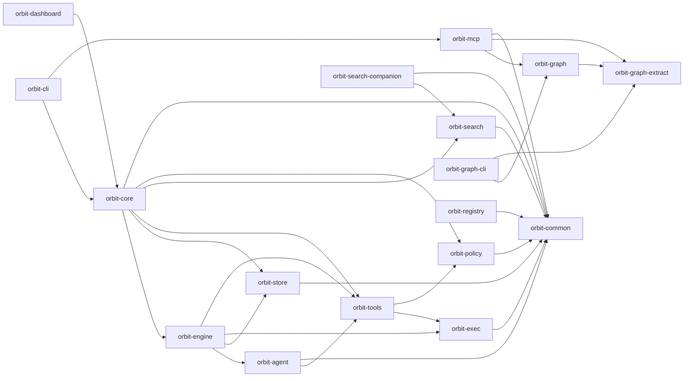

# Architecture

Layered Rust crates. Lower layers do not depend on higher layers.

---

## Crates

- **orbit-common**: leaf — no internal deps. `types::` owns shared domain types, `OrbitError`, ID generation, and activity/job schemas; `utility::` owns generic helpers like fs, redaction, logging, and blob storage.
- **orbit-policy**: filesystem-scoping policy engine. Owns `FsProfile` resolution and `denyRead` / `denyModify` evaluation. Depends only on `orbit-common`.
- **orbit-exec**: process / sandbox / supervision primitives for shell-command execution under an `FsProfile`. Depends only on `orbit-common`.
- **orbit-search**: retrieval and ranking feature crate. Owns lexical docs/ADR scoring, the `Embedder` trait, JSON-Lines RPC types, `SubprocessEmbedder`, `NoopEmbedder`, the workspace-local vector store (`vector::VectorStore` with its own `rusqlite::Connection`, WAL + busy_timeout pragmas, idempotent `embeddings` / `corpus_fts` schema, `EmbedWorker`, paragraph chunker, BLAKE3 dedup, BM25, cosine, and reciprocal-rank fusion helpers), and the install/uninstall/reindex/stats `commands::*` surface. Depends only on `orbit-common`; does not depend on `orbit-core`, `orbit-store`, or fastembed-rs.
  Retrieval and ranking live in `orbit-search`. `orbit-core` owns the domain (corpora, records, lifecycle) and projects records into search-source structs. `orbit-search` owns lexical (BM25), semantic (cosine), and hybrid scoring. CLI verbs are presets layered on the same backend.
- **orbit-search-companion**: separately installed search companion binary. Depends on `orbit-search` and fastembed-rs; not linked into the default `orbit` CLI binary.
- **orbit-registry**: generic replicated registry substrate for publication flows. Opaque-bytes payloads + caller-chosen merge classes; optional `transport-git2` feature for git-backed replicas. Depends only on `orbit-common`.
- **orbit-graph-extract**: pure graph extraction contracts and language-specific tree-sitter extractors for the orbit-graph migration. Owns `Extractor`, `ExtractedFile`, raw row shapes, and the stable `Selector` parser; no internal crate dependencies, storage, async, or filesystem traversal.
- **orbit-graph**: SQLite graph store, sync policy, watcher-backed background refresh, and query API for the orbit-graph migration. Depends on `orbit-graph-extract` for selector/extraction contracts; the ORB-00377 watcher work adds only the external `notify` crate and no new internal crate edge.
- **orbit-graph-cli**: clap-based JSON command surface for orbit-graph. Depends on `orbit-graph` for sync/query dispatch and `orbit-graph-extract` for selector parsing.
- **orbit-store**: layered store pattern (YAML + SQLite). Match existing modules when adding new ones. Depends only on `orbit-common`; the semantic vector schema is owned by `orbit-search::vector` (not `orbit-store`).
- **orbit-tools**: tool registry plus built-in fs and policy-aware exec tools. Depends on `orbit-common`, `orbit-exec`, `orbit-policy`. (The v1 `orbit.graph.*` builtins were decommissioned in ORB-00391; the agent graph surface now lives in `orbit-mcp`'s in-process orbit-graph adapter.)
- **orbit-mcp**: Model Context Protocol adapter using `rmcp`. Depends on `orbit-common` plus `orbit-graph` / `orbit-graph-extract` for the in-process read-only `orbit.graph.*` wrappers — the sole agent-facing graph surface since the ORB-00391 v2 cutover; consumed by `orbit-cli` via `orbit mcp serve`.
- **orbit-dashboard**: read-only web dashboard (axum server + embedded HTML/JS assets + JSON API handlers for tasks, runs, scoreboard, logs, etc.). Depends on `orbit-core` (for OrbitRuntime/OrbitError and the `metrics::aggregate` knowledge-stats summary) plus axum/clap/chrono/serde; consumed by `orbit-cli` via `web serve`. Extracted from orbit-cli in ORB-00146 to isolate compile graph and co-locate assets. The only public surface is `serve(runtime, ServeArgs)`.
- **orbit-agent**: per-provider `AgentRuntime` implementations under `providers/<name>/<name>_runtime.rs` (claude, codex, gemini, openai_compat, anthropic, ollama, mock_agent). Implements `backend: cli`, hosts HTTP `LoopTransport` primitives, and routes loop tool calls through the shared `orbit-tools` registry. Depends on `orbit-common` and `orbit-tools`.
- **orbit-engine**: activity/job execution, template rendering, retry logic, subprocess execution, and tool-aware automation. Owns the `backend: cli` subprocess runner (`activity_job::cli_runner`), which references `orbit-agent::{Agent, AgentConfig}` directly so orbit-core stays clean of orbit-agent types. Depends on `orbit-agent`, `orbit-common`, `orbit-exec`, `orbit-store`, and `orbit-tools`.
- **orbit-core**: runtime bootstrap, config layering, command dispatch, default asset seeding, thin command facades for policy, tool, store, engine, and search features, and the `metrics` module (tool-invocation knowledge-stats computation migrated out of orbit-knowledge in ORB-00391). Surfaces the `OrbitRuntime` API used by `orbit-cli`; does NOT depend on `orbit-agent`.
- **orbit-cli**: clap-based CLI entry point.

---

## Stability tiers

Each workspace crate declares a stability tier in its `Cargo.toml` under `[package.metadata.orbit]`. `scripts/check-stability.sh` (wired into `make ci`) fails closed if a crate is missing the marker or sets a value outside the allowed set. The current contract is marker-only — no automated public-API diff — but the tiering exists to make refactor scope explicit for reviewers.

- **stable** — Public-ish surface. Breaking changes need conscious owner sign-off. (No automated diff today; this is intent-signalling only.)
- **experimental** — Free to refactor; downstream crates depend at their own risk.
- **internal** — Refactor freely; no external/downstream guarantees.

| Crate                 | Tier         |
|-----------------------|--------------|
| orbit-common          | stable       |
| orbit-store           | stable       |
| orbit-search-companion | experimental |
| orbit-registry        | experimental |
| orbit-agent           | internal     |
| orbit-cli             | internal     |
| orbit-core            | internal     |
| orbit-graph           | internal     |
| orbit-graph-cli       | internal     |
| orbit-search           | internal     |
| orbit-engine          | internal     |
| orbit-exec            | internal     |
| orbit-mcp             | internal     |
| orbit-dashboard       | internal     |
| orbit-policy          | internal     |
| orbit-tools           | internal     |

---

## Scoping Rules

| Artifact        | Strategy           | Rationale                                        |
|-----------------|--------------------|--------------------------------------------------|
| Tasks           | WorkspaceOnly      | Per-repo backlog, no cross-project leaking       |
| Activities/Jobs | MergeByKey         | Global defaults + workspace overrides            |
| Policies        | MergeByKey         | Workspace overrides profiles by name; global `denyRead` / `denyModify` rules accumulate |
| Job Runs        | WorkspaceOnly      | Execution artifacts are workspace-local          |
| Skills          | MergeByKey         | Global defaults in `~/.orbit/skills`; workspace overrides by skill name |
| Command Audit   | GlobalOnly         | Single authoritative SQLite event trail          |
| Semantic Index  | WorkspaceOnly      | Task-derived embeddings stay with the workspace  |
| Run Traces      | WorkspaceOnly      | Per-repo activity/job JSONL and blob artifacts   |
| ADR/Learning IDs | Shared allocator + worktree-local bodies | ID rows live in shared `.orbit/state/semantic.db`; body files live in the current worktree so they can be staged with code |
