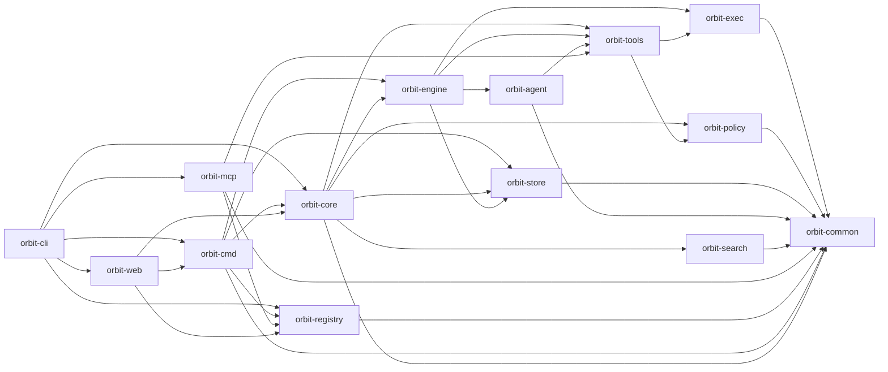

# Architecture

Layered Rust crates. Lower layers do not depend on higher layers.

```mermaid
flowchart LR
  CLI["orbit-cli"] --> Core["orbit-core"]
  CLI --> Cmd["orbit-cmd"]
  CLI --> Registry["orbit-registry"]
  CLI --> MCP["orbit-mcp"]
  CLI --> Web["orbit-web"]
  Cmd --> Core
  Cmd --> Engine
  Cmd --> Registry
  Cmd --> Store
  Core --> Engine["orbit-engine"]
  Core --> Store["orbit-store"]
  Core --> Tools["orbit-tools"]
  Core --> Search["orbit-search"]
  Core --> Policy["orbit-policy"]
  Engine --> Agent["orbit-agent"]
  Engine --> Store
  Engine --> Exec["orbit-exec"]
  Engine --> Tools
  Agent --> Tools
  Tools --> Exec["orbit-exec"]
  Tools --> Policy
  Exec --> Common["orbit-common"]
  Policy --> Common
  Store --> Common
  Agent --> Common
  Search --> Common
  MCP --> Common
  MCP --> Registry
  MCP --> Tools
  Registry --> Common
  Web --> Core
  Web --> Cmd
  Web --> Registry
  Cmd --> Common
  Core --> Common
```

The diagram highlights the dependency edges that define the principal layering
boundaries; [`scripts/check-dependency-direction.sh`](scripts/check-dependency-direction.sh)
is the exhaustive crate-edge contract.

Layering constrains dependency direction. Domain crates own their data and
transport concerns; application layers compose them with runtime kernels.
Kernel crates expose reusable mechanisms and never depend back on a vertical
feature.

---

## Crates

- **orbit-common**: leaf — no internal deps. `types::` owns shared domain types, `OrbitError`, ID generation, and activity/job schemas; `utility::` owns generic helpers like fs, redaction, logging, blob storage, selector parsing, and POSIX argument quoting. `operation::` owns the operations-as-data kernel that noun registries such as `friction::operations` are declared in. A noun's operation registry lives here — at the leaf — so every consumer surface can read it without a new dependency edge; the matching handler table lives in `orbit-core` and is joined to it by the noun's verb enum. `authorization::` owns the governed-operation registry and capability decision function; Core supplies the runtime half. MCP v1 explicitly defers that capability decision inside Core while retaining all ordinary domain and sandbox validation.
- **orbit-policy**: filesystem-scoping policy engine. Owns `FsProfile` resolution and `denyRead` / `denyModify` evaluation. Depends only on `orbit-common`.
- **orbit-exec**: process / sandbox / supervision primitives for shell-command execution under an `FsProfile`. Depends only on `orbit-common`.
- **orbit-search**: retrieval and ranking feature crate. Owns lexical docs/ADR scoring, the `Embedder` trait, JSON-Lines RPC types, `SubprocessEmbedder`, `NoopEmbedder`, the workspace-local vector store (`vector::VectorStore` with its own `rusqlite::Connection`, WAL + busy_timeout pragmas, idempotent `embeddings` / `corpus_fts` schema, `EmbedWorker`, paragraph chunker, BLAKE3 dedup, BM25, cosine, and reciprocal-rank fusion helpers), and the install/uninstall/reindex/stats `commands::*` surface. Depends only on `orbit-common` for its library surface; does not depend on `orbit-core` or `orbit-store`.
  Retrieval and ranking live in `orbit-search`. `orbit-core` owns the domain (corpora, records, lifecycle) and projects records into search-source structs. `orbit-search` owns lexical (BM25), semantic (cosine), and hybrid scoring. CLI verbs are presets layered on the same backend.
  It also builds `orbit-search-companion`, a separately installed search companion binary, as an additional `[[bin]]` target (folded from the standalone `orbit-search-companion` crate, ORB-10357); that target alone depends on fastembed-rs and is not linked into the default `orbit` CLI binary.
- **orbit-registry**: machine identity and workspace registry feature crate. It
  owns `host.toml`, the logical workspace catalog and local checkout bindings,
  validation, and atomic file persistence. It contains no shared database,
  command orchestration, MCP transport, or Core runtime execution. Depends only
  on `orbit-common` among workspace crates.
- **orbit-store**: layered generic persistence kernel (files + SQLite). It owns shared backend traits, lock-safe file persistence, SQLite connection/transaction primitives, the namespaced feature-migration ledger, and immutable historical bootstrap migrations. Match existing modules when adding new generic storage infrastructure. Depends only on `orbit-common`; the semantic vector schema is owned by `orbit-search::vector` (not `orbit-store`).
- **orbit-tools**: generic tool registry plus built-in fs, policy-aware exec, and workspace-scoped Orbit definitions. It depends on `orbit-common`, `orbit-exec`, and `orbit-policy`; MCP composes these with its machine-local discovery definitions.
- **orbit-mcp**: Model Context Protocol feature crate using `rmcp`. It owns stdio framing, advertised-name translation, per-call trace creation, structured responses, canonical tool discovery, server identity presentation, and the direct SSH stdio proxy. Registry supplies machine-local facts and Tools supplies definitions whose only routing metadata is global versus workspace-required scope. The CLI-owned host resolves server-local workspaces; Core owns domain validation, auditing, and the future authorization boundary.
- **orbit-web**: HTTP API, embedded dashboard UI, and remote web connection. It owns axum handlers/assets, dashboard mutations, and the dashboard-specific SSH local-forward lifecycle. Depends on `orbit-core` for runtime-backed operations and projections and on `orbit-registry` for global workspace discovery; consumed by `orbit-cli` via `web serve` and `web connect`. Public surface is `ServeArgs`, `ConnectArgs`, and their serve/connect entry points.
- **orbit-agent**: per-provider `AgentRuntime` implementations under `providers/<name>/<name>_runtime.rs` (claude, codex, gemini, gemini_http, grok, openai_compat, anthropic, ollama, mock_agent). Implements `backend: cli`, hosts HTTP `LoopTransport` primitives, and routes loop tool calls through the shared `orbit-tools` registry. Depends on `orbit-common` and `orbit-tools`.
- **orbit-engine**: activity/job execution, template rendering, retry logic, subprocess execution, and tool-aware automation. Owns the `backend: cli` subprocess runner (`activity_job::cli_runner`), which references `orbit-agent::{Agent, AgentConfig}` directly so orbit-core stays clean of orbit-agent types. Depends on `orbit-agent`, `orbit-common`, `orbit-exec`, `orbit-store`, and `orbit-tools`.
- **orbit-core**: neutral runtime bootstrap, config layering, default asset seeding, runtime-integrated command modules, and metrics. It exposes the `OrbitRuntime` kernels composed by `orbit-cmd`, `orbit-cli`, and `orbit-web`; it does not depend on transport or presentation feature crates, `orbit-agent`, or `orbit-cmd`.
- **orbit-cmd**: shared application composition for CLI and Web consumers. It owns CLI-facing command groups plus registry-aware runtime and routine assembly, joining `orbit-core` kernels to `orbit-registry` without reversing either lower-layer dependency. Runtime methods are exposed as per-module `*Commands` extension traits.
- **orbit-cli**: clap-based entry point and local client-configuration surface. It assembles MCP, Registry, Web, and Core. `mcp serve --mode remote` delegates only the byte-transparent SSH process to `orbit-mcp`; the accepting machine resolves local state and dispatches through Core.

---

## Stability tiers

Each workspace crate declares a stability tier in its `Cargo.toml` under `[package.metadata.orbit]`. `scripts/check-stability.sh` (wired into `make ci`) fails closed if a crate is missing the marker or sets a value outside the allowed set. The current contract is marker-only — no automated public-API diff — but the tiering exists to make refactor scope explicit for reviewers.

- **stable** — Public-ish surface. Breaking changes need conscious owner sign-off. (No automated diff today; this is intent-signalling only.)
- **experimental** — Free to refactor; downstream crates depend at their own risk.
- **internal** — Refactor freely; no external/downstream guarantees.

| Crate                 | Tier         |
|-----------------------|--------------|
| orbit-common          | stable       |
| orbit-store           | stable       |
| orbit-registry        | internal     |
| orbit-agent           | internal     |
| orbit-cli             | internal     |
| orbit-cmd             | internal     |
| orbit-core            | internal     |
| orbit-search           | internal     |
| orbit-engine          | internal     |
| orbit-exec            | internal     |
| orbit-mcp             | internal     |
| orbit-web             | internal     |
| orbit-policy          | internal     |
| orbit-tools           | internal     |

---

## Scoping Rules

| Artifact        | Strategy           | Rationale                                        |
|-----------------|--------------------|--------------------------------------------------|
| Tasks           | WorkspaceOnly      | Per-repo backlog, no cross-project leaking       |
| Activities/Jobs | MergeByKey         | Global defaults + workspace overrides            |
| Policies        | MergeByKey         | Workspace overrides profiles by name; global `denyRead` / `denyModify` rules accumulate |
| Job Runs        | WorkspaceOnly      | Execution artifacts are workspace-local          |
| Skills          | MergeByKey         | Global defaults in `~/.orbit/skills`; workspace overrides by skill name |
| Command Audit   | GlobalOnly         | Single authoritative SQLite event trail          |
| Semantic Index  | WorkspaceOnly      | Task-derived embeddings stay with the workspace  |
| Run Traces      | WorkspaceOnly      | Per-repo activity/job JSONL and blob artifacts   |
| ADR/Learning IDs | Shared allocator + worktree-local bodies | ID rows live in shared `.orbit/state/semantic.db`; body files live in the current worktree so they can be staged with code |
