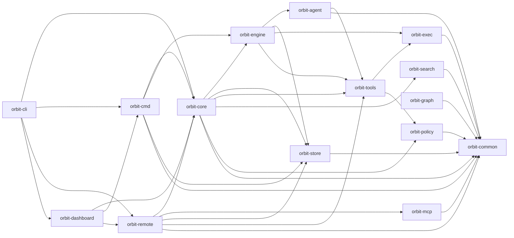

# Architecture

Layered Rust crates. Lower layers do not depend on higher layers.

```mermaid
flowchart LR
  CLI["orbit-cli"] --> Core["orbit-core"]
  CLI --> Cmd["orbit-cmd"]
  CLI --> Remote["orbit-remote"]
  CLI --> Dashboard["orbit-dashboard"]
  Cmd --> Core
  Cmd --> Engine
  Cmd --> Store
  Core --> Engine["orbit-engine"]
  Core --> Store["orbit-store"]
  Core --> Tools["orbit-tools"]
  Core --> Search["orbit-search"]
  Core --> Policy["orbit-policy"]
  Engine --> Agent["orbit-agent"]
  Engine --> Store
  Engine --> Exec["orbit-exec"]
  Engine --> Tools
  Agent --> Tools
  Graph["orbit-graph"] --> Common
  Tools --> Exec["orbit-exec"]
  Tools --> Policy
  Exec --> Common["orbit-common"]
  Policy --> Common
  Store --> Common
  Agent --> Common
  Search --> Common
  MCP --> Common
  Dashboard["orbit-dashboard"] --> Core
  Dashboard --> Cmd
  Cmd --> Common
  Core --> Common
  Remote --> Core
  Remote --> MCP["orbit-mcp"]
  Remote --> Store
  Remote --> Tools
  Remote --> Common
  Dashboard --> Remote
```

Layering constrains dependency direction; it does not require every feature to
be split by technical layer. A vertical feature crate may own its domain model,
persistence queries and migrations, transport policy, and composition end to
end while depending on neutral kernels. Kernel crates expose reusable
mechanisms and never depend back on a vertical feature. [ORB-10319, ADR-0240]

---

## Crates

- **orbit-common**: leaf — no internal deps. `types::` owns shared domain types, `OrbitError`, ID generation, and activity/job schemas; `utility::` owns generic helpers like fs, redaction, logging, blob storage, and the canonical `Selector` grammar (`utility::selector`, ADR-0202); `operation::` owns the operations-as-data kernel (ADR-0209 bearing 1, ORB-10358) that noun registries such as `friction::operations` are declared in. A noun's operation registry lives here — at the leaf — precisely because every consumer surface must read it without any new dependency edge; the matching handler table lives in `orbit-core` and is joined to it by the noun's verb enum (ADR-0253). See [docs/design/operations-as-data/](docs/design/operations-as-data/).
- **orbit-policy**: filesystem-scoping policy engine. Owns `FsProfile` resolution and `denyRead` / `denyModify` evaluation. Depends only on `orbit-common`.
- **orbit-exec**: process / sandbox / supervision primitives for shell-command execution under an `FsProfile`. Depends only on `orbit-common`.
- **orbit-search**: retrieval and ranking feature crate. Owns lexical docs/ADR scoring, the `Embedder` trait, JSON-Lines RPC types, `SubprocessEmbedder`, `NoopEmbedder`, the workspace-local vector store (`vector::VectorStore` with its own `rusqlite::Connection`, WAL + busy_timeout pragmas, idempotent `embeddings` / `corpus_fts` schema, `EmbedWorker`, paragraph chunker, BLAKE3 dedup, BM25, cosine, and reciprocal-rank fusion helpers), and the install/uninstall/reindex/stats `commands::*` surface. Depends only on `orbit-common` for its library surface; does not depend on `orbit-core` or `orbit-store`.
  Retrieval and ranking live in `orbit-search`. `orbit-core` owns the domain (corpora, records, lifecycle) and projects records into search-source structs. `orbit-search` owns lexical (BM25), semantic (cosine), and hybrid scoring. CLI verbs are presets layered on the same backend.
  It also builds `orbit-search-companion`, a separately installed search companion binary, as an additional `[[bin]]` target (folded from the standalone `orbit-search-companion` crate, ORB-10357); that target alone depends on fastembed-rs and is not linked into the default `orbit` CLI binary.
- **orbit-remote**: vertical remote-execution and registry feature. Its modules
  co-locate registry identity/catalog/cache/service, registry persistence and
  feature migrations, MCP contract/schema/learning composition, broker
  placement and audit, hub authority, bounded SSH links, and spoke registration.
  Shared DTOs remain in `orbit-common`; generic workspace-scoped builtin
  definitions remain in `orbit-tools`; generic MCP framing and raw-client
  primitives remain in `orbit-mcp`; neutral runtime and coordination kernels
  remain in `orbit-core`; generic SQLite connection and migration-ledger
  infrastructure remains in `orbit-store`. Those lower layers must never depend
  back on Remote. [ORB-10319, ADR-0240]
- **orbit-graph**: SQLite graph store, sync policy, watcher-backed background refresh, query API, extraction contracts, language-specific tree-sitter extractors, and the clap-based JSON command layer, all for the orbit-graph migration. Depends on `orbit-common` for the canonical `Selector` parser (re-exported from `orbit-common::utility::selector`, ORB-10011/ADR-0202) and for the `GraphError` → `OrbitError` boundary translator (`graph_error_to_orbit`, ORB-10013); the ORB-00377 watcher work adds only the external `notify` crate and no new internal crate edge. ORB-10357 folded the former `orbit-graph-extract` and `orbit-graph-cli` crates in as the `extract` and `cli` modules and removed the `orbit graph` subcommand from `orbit-cli`: the crate now has **zero workspace dependents** and is parked awaiting deletion — no further investment.
- **orbit-store**: layered generic persistence kernel (YAML + SQLite). It owns shared backend traits, SQLite connection/transaction primitives, the namespaced feature-migration ledger, and immutable historical bootstrap migrations, but not Remote's active registry schema or queries. Match existing modules when adding new generic storage infrastructure. Depends only on `orbit-common`; the semantic vector schema is owned by `orbit-search::vector` (not `orbit-store`).
- **orbit-tools**: generic tool registry plus built-in fs, policy-aware exec, and workspace-scoped Orbit definitions. It depends on `orbit-common`, `orbit-exec`, and `orbit-policy`; Remote-only discovery definitions are composed by `orbit-remote`.
- **orbit-mcp**: generic Model Context Protocol server/client kernel using `rmcp`. It depends only on `orbit-common` and owns framing, server composition, raw injected-duplex client primitives, and extension contracts. `orbit-remote` owns contract negotiation, schema/learning composition, the bounded SSH link pool, placement router, and hub authority [ORB-10269]. The code graph has no MCP or CLI surface as of ORB-10357 [ORB-10325, ADR-0241].
- **orbit-dashboard**: read-only web dashboard (axum server + embedded HTML/JS assets + JSON API handlers for tasks, runs, scoreboard, logs, etc.). Depends on `orbit-core` for runtime-backed projections and on `orbit-remote` for registry-backed global workspace discovery; consumed by `orbit-cli` via `web serve`. Extracted from orbit-cli in ORB-00146 to isolate compile graph and co-locate assets. Public surface is `ServeArgs` plus two entry points: `serve_from_env(args)` — what `orbit web serve` actually calls; always serves every registered workspace, global mode being the only mode as of ORB-10029 — and `serve(runtime, args)` for callers that already hold an `OrbitRuntime` and want single-workspace mode embedded directly.
- **orbit-agent**: per-provider `AgentRuntime` implementations under `providers/<name>/<name>_runtime.rs` (claude, codex, gemini, openai_compat, anthropic, ollama, mock_agent). Implements `backend: cli`, hosts HTTP `LoopTransport` primitives, and routes loop tool calls through the shared `orbit-tools` registry. Depends on `orbit-common` and `orbit-tools`.
- **orbit-engine**: activity/job execution, template rendering, retry logic, subprocess execution, and tool-aware automation. Owns the `backend: cli` subprocess runner (`activity_job::cli_runner`), which references `orbit-agent::{Agent, AgentConfig}` directly so orbit-core stays clean of orbit-agent types. Depends on `orbit-agent`, `orbit-common`, `orbit-exec`, `orbit-store`, and `orbit-tools`.
- **orbit-core**: neutral runtime bootstrap, config layering, default asset seeding, runtime-integrated command modules, and metrics. It exposes the `OrbitRuntime` kernels composed by `orbit-cmd`, `orbit-cli`, `orbit-dashboard`, and `orbit-remote`; it does not depend on the vertical Remote feature, `orbit-agent`, or `orbit-cmd`. Root re-exports are trimmed to the consumer-justified set (ORB-10016, ADR in [docs/design/orbit-core/4_decisions.md](docs/design/orbit-core/4_decisions.md)).
- **orbit-cmd**: CLI-facing command layer extracted from orbit-core (ORB-10016): workspace doctor, migrate status/dry-run, diagnostics readers, agent-rules injection, hook install + learning/review-thread PreToolUse hook, and the direct v2 activity runner. Pure consumer of `OrbitRuntime`'s public API; runtime methods are exposed as per-module `*Commands` extension traits. Depends on `orbit-core`, `orbit-engine` (v2 dispatch), `orbit-store`, `orbit-common`; consumed by `orbit-cli` and `orbit-dashboard`. orbit-core must never depend on it.
- **orbit-cli**: clap-based entry point and local client-configuration surface. Remote broker/hub/link construction and spoke registration delegate to `orbit-remote`; it has no graph dependency as of ORB-10357.

---

## Stability tiers

Each workspace crate declares a stability tier in its `Cargo.toml` under `[package.metadata.orbit]`. `scripts/check-stability.sh` (wired into `make ci`) fails closed if a crate is missing the marker or sets a value outside the allowed set. The current contract is marker-only — no automated public-API diff — but the tiering exists to make refactor scope explicit for reviewers.

- **stable** — Public-ish surface. Breaking changes need conscious owner sign-off. (No automated diff today; this is intent-signalling only.)
- **experimental** — Free to refactor; downstream crates depend at their own risk.
- **internal** — Refactor freely; no external/downstream guarantees.

| Crate                 | Tier         |
|-----------------------|--------------|
| orbit-common          | stable       |
| orbit-store           | stable       |
| orbit-remote          | experimental |
| orbit-agent           | internal     |
| orbit-cli             | internal     |
| orbit-cmd             | internal     |
| orbit-core            | internal     |
| orbit-graph           | internal     |
| orbit-search           | internal     |
| orbit-engine          | internal     |
| orbit-exec            | internal     |
| orbit-mcp             | internal     |
| orbit-dashboard       | internal     |
| orbit-policy          | internal     |
| orbit-tools           | internal     |

---

## Scoping Rules

| Artifact        | Strategy           | Rationale                                        |
|-----------------|--------------------|--------------------------------------------------|
| Tasks           | WorkspaceOnly      | Per-repo backlog, no cross-project leaking       |
| Activities/Jobs | MergeByKey         | Global defaults + workspace overrides            |
| Policies        | MergeByKey         | Workspace overrides profiles by name; global `denyRead` / `denyModify` rules accumulate |
| Job Runs        | WorkspaceOnly      | Execution artifacts are workspace-local          |
| Skills          | MergeByKey         | Global defaults in `~/.orbit/skills`; workspace overrides by skill name |
| Command Audit   | GlobalOnly         | Single authoritative SQLite event trail          |
| Semantic Index  | WorkspaceOnly      | Task-derived embeddings stay with the workspace  |
| Run Traces      | WorkspaceOnly      | Per-repo activity/job JSONL and blob artifacts   |
| ADR/Learning IDs | Shared allocator + worktree-local bodies | ID rows live in shared `.orbit/state/semantic.db`; body files live in the current worktree so they can be staged with code |
