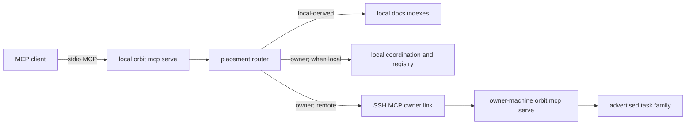
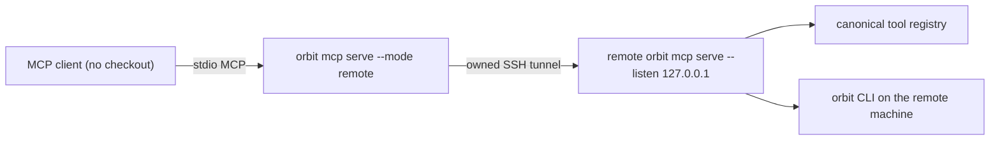

# Orbit MCP Bridge — Design

> **Learning-subsystem retirement.** [ORB-10736] / [ADR-0359] removed the native
> project-learning resource. Learning-specific mechanisms remain only where a
> superseded decision needs historical context; none is current or deferred work.

> **Status: Draft — structural rewrite landed.** The singular-hub contract
> ([ADR-0226], [ADR-0229], [ADR-0230]) is superseded by [ADR-0355]–[ADR-0358],
> recorded in [../host-registry/4_decisions.md](../host-registry/4_decisions.md).
> Every machine is its own coordination host for the workspaces it owns; the only
> v1 cross-machine surface is the advertised `orbit.task.*` family against the owner machine. Sections
> describing execution placement, run leases, the presence map, the `runner`
> capability, and host registration are **deferred to v2** and are retained below
> only as history.

This document records the **landed** design. The host-registry identity,
workspace, registry core/projections, C3 discovery tools, and typed placement,
capability, scope, and trusted-session metadata they depend on have landed. C4
first placed identity, catalog, cache, and the store-backed registry service in
`orbit-registry` ([ORB-10302], [ADR-0235]); [ORB-10319] renames and widens that
crate into the vertical `orbit-remote` feature boundary proposed by [ADR-0240].
The local checkout-aware broker, exact-worktree runtime cache, and effective-
capability filtering landed in [ORB-10262]. Strict machine-global trust
configuration and the fixed checkoutless hub endpoint landed in [ORB-10268]. The
bounded negotiated SSH connector landed in [ORB-10269], and private spoke
registration plus the first end-to-end coordination slice landed in [ORB-10271]
(registration retired in the v1 ownership model). [ORB-10272] added a dormant
Remote-v2 sequence and connector-private allocation substrate for ADR/learning
IDs; that substrate is **abandoned**, not dormant — [ADR-0357] removes global
knowledge IDs entirely, so it encodes a superseded model and is removed rather
than parked.
It replaces both
Bridge's HTTP parity layer and the earlier
per-workspace-authority draft with a local broker whose only remote destination is
a workspace's owner machine. It covers client→owner transport and local tool
placement. Execution placement and leasing are deferred to v2 ([ADR-0358]); see
[host-registry/2_design.md §4](../host-registry/2_design.md).

## 1. Coupled Contract with Host Registry

The two features have a strict ownership split:

| Question | Owner |
|----------|-------|
| What is this machine's stable identity? | Host registry (`host.toml`) |
| Which task-id prefix does this machine own? | Host registry (`host.toml`, chosen at global init) |
| Which machine owns this workspace? | Host registry (`workspaces.json`, machine-local source of truth) |
| Which placement executes an MCP tool? | MCP bridge (canonical placement metadata) |
| How does a client reach an owner machine? | MCP bridge (`mcp.toml` trust + SSH-carried MCP) |
| Which tools may this client invoke? | MCP bridge (capability set) |
| How are owner and local results composed? | MCP bridge (tool-specific composite implementation) |

### 1.1 One vertical implementation boundary

The conceptual split above does not require a crate split. Host registry and MCP
bridge are one vertical feature in `orbit-remote`:

```text
orbit-cli / orbit-dashboard
  └── orbit-remote
        ├── registry identity, catalog, cache, profiles, routines
        ├── persistence over the shared orbit.db
        └── MCP schema composition, broker, owner link
              ├── orbit-core
              ├── orbit-store
              ├── orbit-tools
              ├── orbit-mcp
              └── orbit-common
```

Remote owns every registry-aware policy and SQL statement. Store owns generic
SQLite connection/transaction lifecycle and the namespaced feature-migration
ledger; MCP owns generic RMCP framing, structural schema resolution, and raw client
transport; Tools owns generic builtin definitions; Core owns transport-independent
runtime and `HubCoordinationExecutor`; Common owns shared DTOs. None of those
neutral kernels imports Remote. `orbit-cli`
keeps Clap, client setup/removal, and delegation.
The same config-resolved `orbit.db` is reused, and Remote v1 adopts the existing
registry tables in place rather than creating `remote.db` ([ORB-10319], [ADR-0240]).

The topology is an invariant, not a routing algorithm:

1. A client may open one kind of cross-machine connection: to a workspace's owner
   machine.
2. No machine initiates a connection to a client.
3. No machine forwards or proxies a call on another machine's behalf.
4. Coordination writes against a non-owned local checkout fail closed and name the
   owner.
5. `machine_id`, never renameable `host_id`, is the durable identity in bindings,
   session context, and audit.

Bootstrap order:

1. `orbit init` creates local host identity and records this machine's task-id
   prefix (`ORB-` on an existing install, e.g. `DE-` elsewhere), chosen once and
   immutable thereafter ([ADR-0356]).
2. Only if cross-machine task access is wanted, the operator or an Orbit bootstrap
   helper writes `~/.orbit/mcp.toml` with an owner machine's SSH alias and expected
   `machine_id`, obtained from that machine's `host.toml` over a trusted
   out-of-band channel.
3. `orbit workspace init/link` records ownership of this workspace in the
   machine-local `workspaces.json`.
4. `orbit mcp serve` can now route coordination tools. Missing ownership state
   fails closed rather than writing coordination records for a workspace this
   machine does not own.

V1 does not silently trust the first Orbit process reached through an arbitrary SSH
alias. OpenSSH host-key verification authenticates the SSH endpoint; the separately
copied `machine_id` pins the intended owner machine. A future interactive TOFU flow
may display and confirm the first-seen ID, but it is not the unattended default.

Workspace ownership and transport trust remain separate. A `workspaces.json` entry
records ownership; it does not store an SSH target. `mcp.toml` grants a transport
route only and cannot redefine ownership.

## 2. Process Topology

### 2.1 One client-facing local broker

Every MCP client registers the same command:

```text
orbit mcp serve [--capabilities agent|operator]
```

CLI-generated client config and plugin manifests keep that command fixed. The
manifest does not encode `dk1`, workspace ownership, or operator privilege. The
process reads trusted machine-local state after startup.

The broker starts without requiring a workspace cwd and advertises Orbit's
canonical schemas. Workspace resolution happens from explicit tool input or MCP
session context (§3), continuing [ADR-0199]'s direction.



There is deliberately no edge between two non-owner machines. The retired native
learning subsystem contributes no route or replica mode.

### 2.2 Owner-machine endpoint

The remote process is explicit and non-recursive:

```text
orbit mcp serve --owner [--capabilities agent|operator]
```

`--owner` selects which server the process presents; it asserts no machine-level
role and does not consult `host.toml` mode. Orbit constructs this invocation
itself for the far side of an owner route ([§5.2](#52-ssh-carried-stdio-mcp)) — a
client config never names it. A single process cannot present both the
client-facing broker and the checkoutless owner endpoint at once, so the selector
is what the withdrawn `--hub` flag becomes rather than something v1 removes
outright ([ORB-10727]).

The owner-machine endpoint:

- resolves the caller's selector — registered name, logical ID, or absolute
  checkout path — against **its own** registry, never against the filesystem
  ([§3.1](#31-route-resolution-preserves-identity-and-checkout), [ORB-10787]);
- executes coordination tools for the workspaces it owns;
- refuses any other workspace with the owner named;
- never opens another MCP/SSH connection; and
- reserves stdout for MCP frames.

Orbit constructs the fixed remote command; `mcp.toml` cannot inject arbitrary
shell text.

[ORB-10268] implemented this endpoint under the `--hub` spelling. Startup verified
that the opened global store was stamped with the exact local `machine_id` before
stdio began; listing and every call repeated that authority check. Store-stamp
verification survives with one relaxation: ORB-10268 *required* a stamp and told the
operator to register the hub first, but registration is withdrawn ([ADR-0358]) and
ownership now comes from `workspaces.json`, so an unstamped store has nothing to
contradict and is admitted. A stamp naming a different machine is still refused as
a shadow coordination store. The endpoint
filtered the canonical registry by exactly one placement class and one scalar
capability, composed graph recognition without a local graph implementation,
accepted only stable logical workspace IDs, and invoked the checkout-independent
coordination executor without constructing `OrbitRuntime` or opening any connector.
Every `tools/call` had to carry connector-owned remote session metadata; omission
or an incomplete identity failed before host preflight. All of that survives; the
endpoint is re-specified as the **owner** endpoint with `owner` placement, and the
`--hub` flag and its machine-level mode requirement are withdrawn ([ORB-10727]).
Two guards it carried are relaxed with the protocols that justified them: the
caller no longer has to be an actively registered spoke, because there is no
registry to be registered in, and an unstamped store no longer refuses to serve,
because there is no registration step to stamp it. What is added is the ownership
refusal — a workspace this machine does not own is refused by name, so a client
that reached the wrong owner is told which machine to open a route to rather than
being relayed there.

### 2.3 Owner-local short circuit

When this machine owns the workspace, coordination calls dispatch directly through
the checkout-independent coordination executor keyed by stable `workspace_id`.

Placement and executor are separate questions, and the withdrawn `hub` class used
to conflate them: it meant both "the hub machine" and "the checkoutless
coordination store." Collapsing `hub` into `owner` splits them apart ([ORB-10727]).
Placement answers *which machine*; the checkoutless coordination surface —
`orbit.task.*` and `orbit.friction.*`, exactly what the coordination executor
implements — answers *which executor on it*. Owner-placed tools backed by the
checkout runtime, including `orbit.auto_task.*` and `orbit.session_log.*`, require
the validated owner checkout and are refused when it is absent.
That executor opens only global task/friction coordination stores: it does not
construct `OrbitRuntime`, `WorkspacePaths`, a checkout, owner stores, or local
model/scoreboard configuration. The broker does not SSH to itself or add a
second MCP serialization boundary. Placement and capability preflight remain
identical to the remote path.

## 3. Workspace, Role, and Session Resolution

### 3.1 Route resolution preserves identity and checkout

For every workspace-scoped tool, the broker resolves:

```text
WorkspaceRoute {
  workspace_id,
  local_checkout_root?,
  owned_locally: bool,
  owner_machine_id,
}
```

Workspace address precedence remains:

1. non-empty explicit `workspace` input (registered workspace ID or local path);
2. MCP initialize metadata `initialize.params._meta.orbit.workspace`;
3. otherwise, a clear `missing workspace` error.

Process cwd is not a fallback. A path selector is accepted only at the local edge:
the broker validates the checkout's `.orbit/config.yaml` binding, preserves that
exact root for local-derived and locally owned tools, and resolves its stable
`workspace_id` for coordination tools. The path may be an Orbit-managed worktree
and need not equal the registered base checkout root.

An ID-only selector resolves the machine's registered default checkout when local
execution is required. Coordination tools need no local checkout after the ID is
known. Coordination tools execute locally when this machine owns the workspace.
Task creation and reads may be sent to the owner machine's MCP; every other
coordination write fails closed and names the owner. Local-derived tools require a
validated checkout. Missing/ambiguous local state fails with an instruction to
announce a path rather than silently using the base checkout or another machine.
Composite tools declare their local prerequisites as well: `orbit.search
kind=doc|all` requires a local checkout even though some of its branches could
execute on the owner machine (§7).

Only a validated `workspace_id` crosses the owner route **as session
provenance**. Local absolute paths, replica paths, and worktree roots are never
presented as identity: those fields say "Orbit resolved this", and audit reads
them as such.

#### Deferred selector validation ([ORB-10787])

The lookup above is authoritative only for what this machine coordinates. A
checkoutless client's `workspaces.json` is legitimately empty, so *every*
selector fails there — and a client-side registry miss can only produce false
negatives for a workspace owned elsewhere. The refusal is therefore classified
at the point it is raised:

| Refusal | Meaning | Deferrable |
| --- | --- | --- |
| relative path, `.`, `..` | grammar; no registry can make it valid | no |
| ambiguous registered name | two local records answer to it | no |
| inactive workspace | locally known, deliberately not serving | no |
| unreadable local registry | this machine is broken | no |
| unknown name/ID, or a path this registry does not bind | this machine has no record of it | **yes** |

A path the local registry *does* bind stays local even when it fails to
validate: that is a checkout to repair here, and its message says how.

A deferrable refusal is forwarded when *all* of the following hold: the session
has at least one `[[owner]]` route (a broker with none is a purely local server
and keeps failing closed, unchanged), the tool is on the task surface that may
cross a route ([§4.2](#42-owner-preflight) rule 3), and exactly one configured
route grants the session's capability. Two usable routes make ownership a guess,
and a task write to the wrong owner is not undone by retrying, so that case is
refused by name.

The forwarded selector travels as ordinary **tool input**, which the owner
validates against its own registry, and the session workspace fields stay empty:
the client has no validated identity to offer and must not manufacture one. The
owner's acceptance or rejection is what the caller sees — so an operator who
mistypes a workspace is told so by the machine that would know.

Cost: a path is machine-scoped, so a client naming a path that exists only on
the client resolves nothing and is refused by the owner rather than locally. The
refusal is one round trip slower and names the owner machine instead of the
client, which is the honest answer — the client was never the authority — but it
is a longer path to the same "unknown workspace" conclusion.

### 3.2 Session metadata extension

`ToolSessionContext` expands from one workspace string to transport-owned context:

```json
{
  "workspace": "/local/path/or/ws_id",
  "workspace_id": "ws_orbit",
  "caller_machine_id": "hm_9f2c81d4",
  "caller_host_id": "dk-mac",
  "process_machine_id": "hm_9f2c81d4",
  "process_host_id": "dk-mac",
  "transport": "local",
  "effective_capabilities": ["agent"],
  "origin_session_id": "mcp-...",
  "mcp_call_id": "mcall-..."
}
```

Only `workspace` comes from the external client's initialize metadata and remains an
untrusted address selector until local validation. The adapter/broker derives stable
workspace and caller/process identity, transport, and the complete canonical sorted
effective capability set, then generates the origin session and exactly one call ID
per call before preflight. A run-lease field is reserved for v2 with execution
placement ([ADR-0358]) and has no v1 producer. Capability is always a
set authorized by membership; no scalar ceiling, ordinal, maximum, or selected
authorizing member is valid.

Standalone, un-enveloped stdio uses trusted `transport=local`, exactly `{agent}`,
and audit role `unverified`. Caller JSON cannot supply trusted role, agent/model,
workspace ID, identity, transport, capability, session/call IDs, or
task/run/activity/step correlation. Ambient engine provenance is ignored unless the
existing managed-run marker authenticates the envelope, at which point that managed
identity wins. [ORB-10228]

In the v1 same-user SSH model, caller `machine_id` is provenance rather than a
separate authorization credential: SSH authenticates the OS user, and with no fleet
registry there is nothing that validates the claimed ID at all. A trusted client
could supply another machine's ID by bypassing the Orbit connector. This is an
explicit single-operator trust assumption (§12), not a multi-tenant security
boundary.

## 4. Canonical Tool Placement

### 4.1 Placement is tool-registry metadata

Every MCP-exposed tool definition gains one required placement value and one
typed workspace-resolution scope:

```rust
enum ToolPlacement {
    Owner,        // runs on the machine that owns the workspace
    LocalDerived,
    Composite,
}

enum ToolScope {
    WorkspaceRequired,
    Global,
}
```

Both values live beside the canonical schema and safe-surface metadata. Placement is
not a second connector allowlist and neither property is inferred from a name prefix.
Existing tools default to `workspace-required`; only registry-wide discovery such as
`orbit.workspace.list` and `orbit.crew.list` is explicitly `global` and may execute
without selecting or inferring a workspace. A tool without canonical placement/scope
metadata is not exposed by the multi-host broker.

Initial classification:

| Tool/domain | Placement | Reason |
|-------------|-----------|--------|
| `orbit.task.*` | `owner` | Task lifecycle and artifacts live on the owning machine; task IDs use that machine's prefix |
| `orbit.friction.*` | `owner` | Workspace-scoped triage lifecycle on the owning machine |
| `orbit.workspace.*` | `local-derived` | Ownership bindings live in the machine-local workspace registry, and enumeration returns only the workspaces this machine owns. This is the one `local-derived` entry whose backing state is machine-local rather than checkout-derived |
| `orbit.crew.list`, task crew validation | `owner` | Reads the owner machine's local crew config (§8) |
| `orbit.workflow.*`, run observation | `owner` | Single-host operator broker only in v1 |
| `orbit.auto_task.add/list/show/update/toggle` | `owner` | MCP CRUD manages the Git-versioned definition; it does not mint tasks |
| `orbit.session_log.append/list/resolve` | `owner` | Workspace-local append-only coordination notes live with the owner checkout |
| Docs/semantic index operations if later exposed | `local-derived` | Rebuildable checkout-derived state |
| `orbit.search` | `composite` | Current implementation requires a locally owned checkout and searches task, doc, and friction branches there (§7) |

`orbit.host.*` fleet inventory and `orbit.run.lease/report/presence` have no v1
referent and are withdrawn with registration and execution placement ([ADR-0358]).
`orbit.adr.*` is withdrawn with the ADR store: ADRs are git-committed markdown in
each feature's `4_decisions.md` ([CONVENTIONS.md §4](../CONVENTIONS.md)).

Routine scheduler state stays local and CLI-only. The auto-task scheduler pass is
composite in operation but is not an MCP tool-registry entry: it reads definitions
and the host-local cursor from the machine's checkout, dedupes against the owner
  machine's task state, and creates due tasks there. It must never mint tasks for a
  workspace this machine does not own. Friction is a current lexical
  `orbit.search` branch.

### 4.2 Owner preflight

`Owner` does not mean "find and contact any owner." It means:

1. resolve the owner from the machine-local `workspaces.json`;
2. if the owner is this machine, require a validated owner checkout and execute
   locally;
3. if the owner is another machine and the call is in the advertised
   `orbit.task.*` family, dispatch over the configured owner route;
4. otherwise refuse, naming the owning `machine_id` and the configured route if one
   exists; and
5. never relay the call through a third machine.

### 4.3 Contract ownership and version skew

Remote's canonical composition of generic builtin definitions plus Remote-owned
discovery definitions is the only production schema source. The retired Bridge
service no longer vendors a snapshot, duplicates Pydantic arguments, or recreates
errors. Neither
the generic MCP kernel nor Core owns registry-aware placement/schema policy. The
local broker advertises schemas from its installed Orbit binary and includes an MCP
contract revision plus a digest for the owner-routed subset when opening the owner
route.

The owner machine's binary may differ in release version only when the contract
revision and owner-schema digest match. A mismatch fails owner routing before
dispatch and names both versions/revisions. Local-derived and locally owned tools
may remain usable; there is no translation compatibility layer.

Both connector-private methods are withdrawn. `orbit/private/register-spoke/v1`
goes with the registration protocol ([ADR-0358]) and
`orbit/private/allocate-knowledge-id/v1` with the global knowledge allocator
([ADR-0357]). The contract revision they advanced (to 2 and 3 respectively) is
documented in the conformance pin as history; v1 negotiates no private connector
method.

## 5. Owner-Machine Transport and Trusted Configuration

### 5.1 `mcp.toml` describes owner routes

Trusted configuration is machine-local and names zero or more stable owner
machines:

```toml
# ~/.orbit/mcp.toml

[[owner]]
machine_id = "hm_41a92e70"
transport = "ssh"
host = "dk1"                  # OpenSSH Host alias
allowed_capabilities = ["agent", "operator"]
```

Rules:

- `machine_id` must equal the owner machine's identity as recorded in
  `workspaces.json`. `mcp.toml` cannot redefine ownership.
- `host` is an OpenSSH alias only. V1 accepts no arbitrary SSH command, remote
  shell fragment, extra environment, or per-repository override.
- `allowed_capabilities` is a non-empty, non-hierarchical trust set. A client
  cannot request a capability absent from the set; allowing `operator` does not
  grant `agent`, and allowing `agent` does not grant `operator`.
- Repository `.orbit/config.toml` cannot change a route, SSH target, or capability.
- An owner rename does not break the mapping because `machine_id` is stable.
- For workspaces this machine owns, no transport entry is required; dispatch
  short-circuits locally.

[ORB-10268] froze the on-disk boundary as one optional `[hub]` table under the
machine-global Orbit root; v1 restates that as zero or more `[[owner]]` entries in
the same file. The rest of the frozen boundary is unchanged: the whole document and
every entry reject unknown fields; transport is exactly `ssh`; aliases are
argument-safe OpenSSH host aliases; the allowed list is non-empty and duplicate-free
and typed as `agent|operator`. `runner` is no longer a valid member ([ADR-0358]).
Two entries naming the same `machine_id` are rejected, since a target reached two
ways has no single capability ceiling. Repository, cwd, and environment decoys
cannot override this file. A client missing the route, requesting a capability
outside the exact set, or pointing at itself fails before any transport is opened.

**A legacy `[hub]` table fails closed** with a migration message naming the file and
the replacement form; it is never auto-migrated ([ORB-10727]). The two tables do not
mean the same thing: `[hub]` named a machine-level coordination host, while
`[[owner]]` names the machine that owns a particular workspace. The machine in a
`[hub]` entry need not own any of the reading machine's workspaces, so rewriting one
into the other could silently point coordination calls at a non-owner — the exact
failure the ownership model exists to prevent. Rewriting the table is a one-line
human edit; inferring the routing target is not something the loader may do. The
rejected alternative was auto-migration for a seamless upgrade; the cost of failing
closed is that an existing multi-host deployment does not start until its operator
edits the file, which is the intended prompt.

The route target is the owner machine, so moving ownership between machines changes
which entry a client uses. Routes are per machine, not per workspace: a machine
holding replica checkouts of workspaces owned by several others names each owner
once.

### 5.2 SSH-carried stdio MCP

The client broker starts a fixed command equivalent to:

```text
ssh <owner-alias> orbit mcp serve --owner --capabilities operator
```

and relays MCP frames over stdin/stdout. Orbit performs the handshake, verifies the
contract revision, and sends stable workspace/caller context. SSH owns
authentication, encryption, host verification, keys, and remote OS authorization.
The owner link opens no listening port and invents no credential of its own. §5.3
defines the one listener Orbit does open; it is loopback-bound and reached through
the same SSH posture, so the delegation above is unchanged ([ADR-0350]).

One owner link is cached per target machine and effective capability with a bounded
idle lifetime. A later call may reconnect after failure, but an interrupted mutation
is never retried automatically (§9).

The worker queue is bounded at admission. A full or disconnected queue is a
pre-handoff `owner_unavailable`; once admitted, a call may wait behind an in-flight
request and then receives the result of the worker's bounded initialize/request/
close operations. Queue residence has no separate expiry and the synchronous
caller has no shorter deadline that could discard a definitive result.

There is no bootstrap registration step. The private
`orbit/private/register-spoke/v1` handshake, the active-registered-caller recheck on
every ordinary call, and the retirement-invalidates-an-open-peer behaviour landed in
[ORB-10271] and are withdrawn with the registration protocol ([ADR-0358]); a client
opens a route and calls. The staged-result and definitive-success discipline from
that task survives wherever a multi-stage remote operation remains.

### 5.3 Owned tunnel and the checkoutless client

§5.1 and §5.2 describe how a client with a checkout reaches an owner machine. Such
a client has graph, docs, and search that must resolve against the branch its agent
is working on, and placement (§4) exists to guarantee that.

A second client class does not fit that shape. A **checkoutless client** is an MCP
client that owns no workspace this machine coordinates — an off-box orchestrator
whose clone, if it has one, is a read mirror, and whose every workspace lives on
the remote machine. "Owns no workspace" is a statement about this machine's
workspace registry, not about the filesystem: a mirror carries a full `.orbit/`
directory, because a repository that versions its Orbit workspace commits
`config.toml` and the `learnings/`, `auto_tasks/`, `resources/`, and `routines/`
partitions, and `git clone` delivers all of it. Holding that directory is
therefore not holding local-derived state. Placement routing protects nothing for
such a client and only makes the canonical surface unreachable, which is what
forces the re-declared parity layer §10 retires.

For this client, **reachability is the scarce resource, not tool schemas**. An
orchestrator that cannot execute on the machine routes trivial reads through full
worker runs — disproportionate to the work, and slow enough to distort how often
such checks happen at all.

#### The tunnel is the primitive

Orbit establishes or reuses an SSH tunnel to a **loopback-bound listener** on the
remote machine ([ADR-0350]):

```text
# on the remote machine
orbit mcp serve --listen 127.0.0.1:<port> [--capabilities agent|operator]

# on the client machine — what the MCP client registers
orbit mcp serve --mode remote <ssh-alias>
```



The tunnel is a reusable primitive rather than an implementation detail of one
consumer: anything needing the remote machine rides it instead of opening a second
mechanism. Its properties:

- **The listener binds loopback only**, refusing any other host exactly as
  `orbit web serve` does ([ADR-0201], [ORB-00360]). SSH owns authentication,
  encryption, and host verification. Orbit adds no credential, ACL, or session of
  its own — the same delegation §5.2 makes, applied to a tunnel rather than a
  spawned process. The guarantee now rests on the bind guard rather than on the
  absence of a listener, which makes that guard security-critical.
- **Capability is chosen by whoever starts the listener**, never by the client.
  Filtering and audit run on the remote through the paths that already implement
  them (§8, §9).
- Tunnel management reuses the existing SSH-tunnel mechanism rather than adding a
  second one ([remote-access/2_design.md §3](../remote-access/2_design.md)). That
  mechanism always started a remote process; serving a long-lived listener
  requires it to attach to one already running and start one only when nothing
  answers, which [ORB-10708] added. [ORB-10710] made the reuse structural by
  moving the mechanism itself to `orbit-common::utility::ssh_tunnel`
  ([ADR-0354]) — `orbit-dashboard` already depends on `orbit-remote`, so the
  proxy could not otherwise call into the only implementation. Each consumer
  supplies its own readiness probe and remote command; nothing else is
  duplicated.

#### Calls resolve remotely, and only for this client class

Every placement class resolves on the remote, which is correct precisely because
the client holds no local-derived state. This narrows the placement rule to clients
that hold local-derived state; owner-machine routing is defined in §4.2.

**The mode refuses to start on a machine that owns a checkout.** Without that guard
a machine with a checkout could register it and receive another machine's branch
state as its own, surfacing as wrong answers rather than as an error. The guard is
the load-bearing half of the decision, not a convenience.

Ownership is read from this machine's workspace registry alone ([ADR-0360]): a
checkout binding the working directory — including through an explicit path
override — or any registered checkout whose repository root still exists. A stale
registry row pointing at a deleted tree is history, not a checkout. An `.orbit/`
directory the registry does not bind is **not** evidence and is not consulted,
because it is exactly what a read mirror carries; the same rule the local broker
already applies, since a session binds only to a registered checkout (§4.2) and an
unregistered directory yields no local-derived state to protect. The refusal names
the owning workspace, its path, and `orbit mcp serve` as the surface to register
instead. The residual gap is a machine that develops in a checkout it never
registered: it is admitted, and the mode will answer from the remote's branch state
while a local tree sits under it.

Nothing re-declares a schema or reshapes a response: both ends are the same build,
so the drift §1 attributes to Bridge is structurally absent rather than tested
for.

#### Command execution rides the tunnel

The tunnel adds exactly one operation to the surface ([ADR-0351]). **Command**
takes an argv array and an explicit working directory — never a shell string, so
quoting and operator-precedence bugs are structurally impossible rather than
merely discouraged.

It requires operator capability *and* the workspace claim
([host-registry/2_design.md §3.2](../host-registry/2_design.md)), and is withheld
from managed runs, which could otherwise bypass the self-dispatch guard (§8.2) by
invoking the CLI. A client without the claim does not receive it at all.

That restriction is deliberately **not** an allowlist over argv: a filtered
command surface leaks through `bash -c`, `env`, `xargs`, `make`, interpreter `-c`
flags, and version-control hooks. The boundary is whether the operation exists for
that caller, not which binaries it may name.

The honest cost is that a claim-holding client can reach any governed operation by
invoking the CLI, so filtering above command is advisory for it. That is accepted
because establishing the tunnel already presupposes SSH to the machine, and anyone
with SSH can already run anything there. It is not accepted for the default
surface, which is why the gating is part of the decision rather than a deployment
choice.

#### The advertised surface is unchanged

Orbit's per-tool definitions are **derived from the tool registry**, not
hand-written: a tool is declared once with its schema and registered with a
policy, and the advertised set is computed from those entries. The duplication
this feature exists to remove was an external process re-declaring those schemas
in another language, which the tunnel already eliminates. What the advertised
surface actually costs is per-tool policy and placement metadata, the conformance
test pinning the definition count, the contract digest, and the context those
definitions occupy in every client request.

That cost is modest, so the surface stays as it is. Clients keep native tool
selection, call-time argument validation, and per-tool audit attribution; only
command itself degrades provenance to an argv. Replacing the advertised
definitions with generic enumerate and invoke-by-name operations is left open in
[3_vision.md §1](./3_vision.md), not decided here.

Two consequences follow and are accepted deliberately. Two paths now reach the
same operations — the advertised tool, and the CLI through command. And deciding
later whether the advertised surface earns its place needs evidence no current
endpoint produces: `/metrics/tools` is an ungrouped invocation count with no
caller dimension, so the usable cut is over audit events with job-run and
activity-bearing rows excluded, or engine and worker traffic swamps the
orchestrator's. Until that cut exists, retention is deferral rather than
measurement.

What makes this reversible is not the measurement but the generation: the
definitions come from the registry, so removing them later is a revert, not a
rebuild.

#### What this is not

The tunnelled listener carries no placement routing and resolves everything on the
remote; it takes no `mcp.toml` entry and performs no workspace-ownership
resolution. It is the same SSH posture §5.1 configures, applied to a tunnel rather
than a spawned process — there is no separate star topology left to protect. What
[ADR-0350] recorded as "deliberately not a hub link" now reads as: the tunnel is a
transport, and §4.2's ownership preflight is a property of the machine that serves
the call, not of the pipe that carried it.

`crates/orbit-mcp/src/tcp.rs` already implements the listener with one server
instance per connection ([ORB-10690], [ADR-0348]). [ORB-10710] adds the CLI
surface, the client-side mode, and the checkout guard; [ORB-10711] implemented the
claim-gated `orbit.command.exec` rider recorded by [ADR-0351].

#### How the client-side mode is built

`orbit mcp serve --mode remote <ssh-alias>` is a **byte relay**, and that is the
whole implementation:

- `orbit-remote::mcp::proxy` refuses on a machine holding a checkout, establishes
  or attaches to one tunnel, and opens **one** TCP connection through it for the
  whole stdio session. Nothing is re-established per call.
- `orbit-mcp::relay` pumps bytes between that connection and stdio. It parses no
  frames and knows nothing about tools, so a response is byte-identical to the
  same call made against the listener directly — the drift §1 attributes to
  Bridge is absent by construction rather than by test.
- Two signals decide the guard: a checkout registered in `workspaces.json` whose
  `repo_root` still exists, and a non-global workspace `.orbit/` found by walking
  up from the working directory. A registry row pointing at a deleted tree is stale, not
  evidence; refusing on it would strand a genuinely checkoutless client.
- **No `McpTransport` variant is added.** The listener already stamps the session
  it serves as trusted-local, and relaying does not change whose session it is.
  Existing checks compare that discriminant by equality rather than
  exhaustively, so a new variant would compile cleanly while failing every one
  of them silently.

## 6. Artifact Semantics

### 6.1 Read/write placement

| Artifact | Current write path | Current read path | Replica/derived path |
|----------|--------------------|-------------------|----------------------|
| Task and task artifact | Owner MCP (in-process when locally owned) | Owner MCP | None |
| Friction | Owner MCP (in-process when locally owned) | Owner MCP | None |
| Session-log entry | Owner checkout runtime | Owner checkout runtime | None |
| Docs search | Local checkout runtime | Local checkout runtime | Local docs/semantic index |
| Routine cursor/pause | Local CLI | Local CLI | Local scheduler store |

This is the shipped cross-machine contract after [ORB-10736]. The native learning
resource, its sidecar, its replica index, and every `orbit.learning.*` operation are
removed, not deferred. ADRs are git-committed markdown in each feature's
`4_decisions.md`; search retrieves them through the doc corpus rather than a
separate store or tool family ([ADR-0359], [CONVENTIONS.md §4](../CONVENTIONS.md)).

Friction records on the owning machine are partitioned by the composite
`(workspace_id, friction_id)` key in the host-global store after [ORB-10680]
([ADR-0345]), so the logical workspace ID scopes every read and write and identical
IDs in two workspaces coexist. `<global_root>/frictions/workspaces/<workspace_id>`
remains the file tree that carries the tag taxonomy and legacy import evidence.

`orbit.task.artifact.put` completes capability, workspace, and placement preflight
before opening the caller-local source. It reads at most the typed content limit on
the calling machine and sends a connector-private `{path, media_type, content}` byte
payload under the same canonical tool/audit name. The owner accepts that preloaded
form only on authenticated `ssh-mcp`; caller-local paths never cross the
coordination boundary. Friction responses likewise omit their private backing-file
path ([ORB-10271]).

**`orbit.task.artifact.put` is inside the v1 cross-machine task surface.** It is a
task write, and the v1 rule admits the advertised task family against a remote owner
(§4.2). Other owner-placed families, including friction lifecycle, session logs,
auto-task CRUD, and workflow dispatch, remain local to the owning machine.

### 6.2 Retired knowledge mechanisms

[ORB-10736] removed the native learning types, file and SQLite stores, CLI/MCP/HTTP
routes, unified-search branch, automatic prompt/sidecar delivery, dashboard, and
maintenance jobs. Existing `.orbit/learnings/**` files remain inert historical
repository data. The older F1 allocator and F3 composite-finalization designs were
already withdrawn before removal; public issuance never activated, so no allocated
ID needs migration. There is no current `knowledge_read`, replica-consistency, or
learning lifecycle contract.

## 7. Current `orbit.search`

The shipped search kinds are `task`, `doc`, `friction`, and `all`. ADR entries are
ordinary design-doc markdown and therefore arrive through the `doc` branch. The
runtime ranks each requested branch and merges multiple branches round-robin under
the total limit; hybrid ranking applies to task and doc vectors, while frictions
remain lexical. `semantic=<task-id>` is task-neighbor lookup and supports only
`kind=task|all`.

The MCP registry retains `composite` placement for `orbit.search`, but the broker
does **not** route branches independently. Current preflight requires a validated
checkout owned by this machine and executes the complete query through that local
runtime. A remote-owned workspace or replica checkout is rejected before search;
there is no owner-task/local-doc fan-out and no per-branch routing metadata.

An unscoped request with `all: true` is the separate cross-workspace mode: the
broker runs the same local search against every active locally owned checkout and
adds the logical workspace selector to each row. It still opens no owner route.

The previously documented `knowledge_read = current | replica | omit` input,
`consistency=replica` result metadata, owner/index freshness fields, and learning
branch were never implemented and are now deleted from the contract because the
underlying resource no longer exists ([ORB-10736]). `kind=learning` and the retired
standalone `kind=adr` are rejected with the supported-kind list rather than silently
accepted.

## 8. Capability Sets, Discovery, and Dispatch

Placement answers *where*; capability answers *whether*:

| Capability | Intended holder | Surface |
|------------|-----------------|---------|
| `agent` (default) | Ordinary coding agent | Safe task/friction/search/auto-task/session-log tools plus read-only crew discovery |
| `operator` | Cowork orchestrator or trusted operator | `agent` plus workspace discovery, `workflow.ship`, and run observation |

A `runner` capability is deferred to v2 with execution placement ([ADR-0358]); it
has no v1 referent because there is no registration, presence, or lease to hold.

`operator` does not imply `agent`, and `agent` does not imply `operator`.
Destructive administration remains CLI-only. The effective surface is the
intersection of the requested set, the local `mcp.toml` ceiling, and the owner
machine's policy.

Three independent routing choices remain separate:

| Concern | Source | Meaning |
|---------|--------|---------|
| Caller model | MCP write provenance (`model`) | Which agent family made the call |
| MCP capability | Client request ∩ trust ceiling ∩ owner policy | Which tools the session may use |
| Execution crew | The owner machine's local crew config plus task `crew` | Which provider/model runs the task |

Execution host was a fourth row, selected from the hub host registry plus a per-task
`host`. Both the selector and the registry are deferred to v2; a run executes on the
workspace's owner.

### 8.1 Crew validation reads the owner machine's local config

> **Withdrawn.** This section previously specified an *owner-published execution
> profile*: the workspace owner pushed a frozen `ExecutionProfileV1` (config digest
> and ship-closure digest, [ORB-10257]) to the hub during register/poll, and the hub
> validated crew and dispatch from that projection without contacting the owner
> ([ORB-10276]). Publication rode the registration/poll protocol and had a hub to
> receive it; neither exists in v1 ([ADR-0358]).

In v1 crew validation runs where the workspace is owned, so it reads that machine's
local crew config directly and needs no projection, no generation counter, and no
freshness gate. `orbit.crew.list`, task crew validation, and workflow preflight all
resolve against the same local config.

[ORB-10729] implements that. `orbit_remote::OwnerLocalCrews` is the one service
both `orbit.crew.list` and explicit task-crew validation read through, over
`orbit_core::local_crew_environment` — the same layered `config.toml`
(`<checkout>/.orbit/config.toml` over `<global_root>/config.toml`) and the same
backend precedence a runtime applies, but without constructing one, because the
owner endpoint is checkoutless (§2.3). A workspace with no local checkout reads
the machine-global file alone. Workflow preflight needed no change: it already
resolved crews through the owner's runtime config. The projection *service*
([ORB-10276]'s consumption half, with its clock and TTL) is deleted rather than
parked, and the sanitized `CrewDiscoveryV1` loses its freshness/generation
envelope with it — a config the answering machine can read is current by
construction, so there is nothing for a caller to gate on. The store-level
profile tables stay dormant per
[host-registry/2_design.md §3](../host-registry/2_design.md); what is withdrawn
is every live reader and writer above them.

Two pieces of [ORB-10257] survive the withdrawal and are worth keeping intact,
because they are transport-independent: `config_digest` hashes domain-separated
canonical compact JSON of the normalized crew/config and effective mode/base branch,
and `ship_closure_digest` separately hashes the execution-selected, fully
materialized four-job ship closure with its reachable named and recovery activities,
resolved backends, and versioned static ship contract. Neither contains identities,
clocks, paths, raw config/assets, or environment values. `orbit_remote::build_execution_profile_v1`
still constructs them; only the publication half is withdrawn. See
[host-registry/2_design.md §3](../host-registry/2_design.md) for the dormant
projection tables.

### 8.2 Operator tools and placement

Bridge's former high-level workflow tools moved into Orbit:

| Former Bridge tool | Orbit target |
|--------------|--------------|
| `workspace_list` | `orbit.workspace.list` |
| `workflow_ship` | `orbit.workflow.ship` |
| `workflow_run_status` | `orbit.workflow.run.show` |
| `workflow_run_list` | `orbit.workflow.run.list` |

The `orbit.host.list` MCP discovery tool was removed in [ORB-10332], and the
`orbit host list` CLI command it deferred to has nothing to enumerate without a
fleet inventory ([ADR-0358]). `orbit.workspace.list` returns the workspaces this
machine owns, from the machine-local registry, without exposing absolute paths. Its
MCP-only schema, policy, and sanitized projection live in `orbit-remote`; the human
`orbit workspace list` command remains a separate CLI surface.

`orbit.workflow.ship` receives explicit task IDs and executes on the owner machine's
local runtime. Placement selection, immutable requested/actual placement, the
mailbox posture, and leasing are deferred to v2
([host-registry/2_design.md §4](../host-registry/2_design.md)); MCP bridge never
pushes or relays execution.

V1 is submit + observe. Cancellation and automatic backlog discovery are excluded.
Generic pipeline invoke/wait tools are not compatibility targets for this surface.

[ORB-10534] implements the single-host slice as four owner-class, operator-only
tools: `orbit.workflow.ship`, `orbit.workflow.run.show`,
`orbit.workflow.run.list`, and `orbit.workflow.run.resume`. A deliberate local
operator obtains that surface with `orbit mcp serve --capabilities operator`;
ordinary plugin/local registrations remain fixed to `agent`. The broker resolves
the exact selected checkout and short-circuits workflow execution through its
runtime, so ship and resume reuse the same durable submission services as the
dashboard HTTP endpoints. The runtime converts the authenticated managed-process
marker plus `ORBIT_RUN_ID` into a trusted in-band run scope; ship/resume reject
that scope before host dispatch, preventing a leaf executor from recursively
creating runs without trusting model-authored input.

[ORB-10540] pins that guard from the environment rather than from a hand-built
host: the tool-host tests populate the managed-process marker and `ORBIT_RUN_ID`
and observe ship and resume refused, scrub the same envelope and observe both
admitted, and show `run.show` / `run.list` still answering inside a managed run.
The MCP ship tool and `POST /api/workflows/ship` are also compared directly for
one explicit task-id selection and agree on job id, resolved ship mode, and
coupled task ids. One consequence of that comparison is recorded rather than
changed here: GitHub CI exports no `ORBIT_*`, so only an on-box run exercises
the env-to-scope path at all.

[ORB-10544] closes the other one. The duplicate-dispatch guard for an explicit
task selection was endpoint-local, so the MCP tool could dispatch a second run
for a task already carried by a non-terminal run — two runs then contending for
one worktree and task reservation. The guard now lives in
`OrbitRuntime::submit_ship_run` and refuses with a typed
`OrbitError::ShipRunInFlight { task_id, run_id }`; `orbit.workflow.ship` inherits
it and projects it as a structured `ship_run_in_flight` error naming both ids,
the dashboard projects the same conflict as its stable `409`, and any future
submission adapter inherits it by construction ([ADR-0303]). Auto
(backlog-discovery) submission names no tasks and is not keyed by the guard. The
equivalence test above consequently no longer depends on call ordering.

The fixed checkoutless endpoint cannot yet execute these checkout-backed workflow
tools, so remote workflow execution over the owner route is deferred. This is an
explicit current limitation rather than a fallback to process cwd or another
machine's checkout; the local operator broker is the supported MCP execution path
until owner-side run admission owns a checkout-independent execution service.

## 9. Audit, Identity, and Uncertain Outcomes

Owner-routed calls record one canonical action audit on the owner machine with:

- tool name and workspace ID;
- process host (owner machine) and caller host (originating broker) machine
  IDs/names;
- transport (`local` or `ssh-mcp`) and the complete effective capability set;
- caller model provenance, origin session ID, and `mcp_call_id`; and
- success/failure or preflight denial before the result crosses the owner route.

The legacy audit `host`, `session_id`, and `job_run_id` retain their meanings.
`origin_session_id` is additive, and every outcome for one call shares its one
`mcp_call_id`.

Local-derived and locally owned calls audit locally. Knowledge creation records one
owner-local event. The broker does not duplicate a successful remote domain audit;
it records local transport/preflight failures separately.

If SSH drops after a coordination mutation is dispatched, the outcome is unknown and
the broker returns `mcp_call_id`; it never retries. The caller inspects the owner
machine's state/audit.

## 10. The Bridge Boundary

[ORB-10768] retired Bridge as a whole, not merely its Orbit-shaped compatibility
layer. The only registered clients were on `dk-server-1`, so they moved directly to
the installed binary's local stdio `orbit mcp serve --capabilities operator`.
[ORB-10763]'s listener, SSH alias, and remote-mode registration were therefore
demoted to optional future work; no compatibility window or side-by-side client
registration was needed.

The outcome by former capability is:

| Former Bridge capability | Outcome |
|--------------------------|---------|
| Orbit task, friction, search, workspace, crew, and workflow parity | Canonical Orbit MCP owns it directly |
| ADR and learning parity | Removed with the underlying Orbit stores; ADRs are docs and native learnings are retired |
| Sextant search/session/document retrieval | Removed; Sextant was already decommissioned |
| `agent_invoke` and `agent_run_*` | Deliberately dropped; callers were rewritten to work without worker invocation ([ORB-10767]) |
| `repo_sync` | Descoped with no replacement ([ORB-10767]) |
| Almanac/profile and Bridge-only telemetry | Removed with Bridge; no surviving gateway contract |

The parity domain, vendored schema snapshot, dashboard HTTP translation, workflow
wrappers, edge routes/token, client registrations, units, and worker listener were
retired. The Bridge repository/history was preserved as the record of the deleted
compatibility layer. A future aggregator, if ever justified, must proxy child MCP
contracts generically rather than restore hand-authored Orbit schemas.

## 11. Migration and Validation

### Phase 0 — accept the coupled boundary

- Review this folder and host-registry together.
- Mark `knowledgebase/polaris/design/orbit/orbit-mcp-bridge.md` superseded and point
  it to this repo-local design so the two contracts cannot drift.
- Number the new ADRs per-repo in each feature's `4_decisions.md` only after both
  coupled designs are accepted.
- Decompose [ORB-00424] into ordered implementation tasks.

### Phase 1 — identity and ownership prerequisites

- Land stable host identity, the machine task-id prefix, and `workspaces.json`
  ownership bindings.
- Extend MCP session/audit context with caller/process host identity.
- Single-machine behavior is the degenerate case of the same model — a machine that
  owns everything it holds — so no mode switch exists to migrate through.

### Phase 2 — placement-aware local broker

- Implemented by [ORB-10262]: consume canonical `owner`, `local-derived`, and
  `composite` metadata; preserve exact session checkout/worktree paths for
  graph dispatch and runtime-cache identity; enforce ownership preflight without
  third-machine discovery; and filter `tools/list`/`tools/call` by the
  non-hierarchical effective capability set. Task, artifact, review-thread,
  verdict, and friction calls use the stable-ID checkoutless coordination
  executor; `task.show(with_context=true)` remains explicitly local-derived and a
  non-owner fails closed instead of writing coordination state.

- [ORB-10319] moved the broker, hub, link, trust, registration, and former
  graph/learning composition from CLI/MCP horizontal layers into `orbit-remote`.
  [ORB-10325] subsequently removed graph composition from Remote and MCP, and
  [ORB-10736] removed learning composition; the routing contract now applies only
  to registered tools.

### Phase 3 — owner route

- Implemented by [ORB-10268, ORB-10269]: add trusted route config and the fixed SSH
  endpoint; negotiate contract revision/digest with bounded per-capability reuse;
  propagate workspace/caller/call identity; and prove no automatic mutation retry.
- [ORB-10271]'s private staged registration and active-caller enforcement are
  withdrawn with the registration protocol ([ADR-0358]); its path-free coordination
  frames and one-audit-per-call discipline survive.

### Phase 4 — knowledge and search split

- Friction moved to a workspace-partitioned owner store. The native learning
  resource and the [ORB-10272] allocation substrate were subsequently removed
  outright by [ORB-10736]/[ADR-0359].
- Retire the ADR store in favour of git-committed entries in each feature's
  `4_decisions.md`, which drops the `adr` search kind and the `orbit.adr.*` tool
  family.
- Unified search now supports task, doc, friction, and all. The proposed
  per-branch owner routing, learning replicas, and `knowledge_read` metadata never
  landed and are not deferred because their resource was removed.

### Phase 5 — operator surface (placement deferred to v2)

- Add `orbit.workspace.list` over the machine-local registry, crew discovery from
  the owner machine's local config, and high-level ship/run observation.
- Execution-profile publication, runner lease/report, and immutable
  requested/actual placement are **deferred to v2** ([ADR-0358]).

### Phase 6 — Bridge cutover

- [ORB-10761] narrowed the checkoutless guard to registry ownership, preserving a
  safe remote-client path if one is needed.
- [ORB-10763] inventoried the actual clients and found both were on-box with local
  checkouts. It was demoted to optional: no production listener, tunnel, or SSH
  client registration was required.
- [ORB-10767] decided not to replace Bridge's worker-backed surface:
  `agent_invoke`/`agent_run_*` were dropped, their callers rewritten, and
  `repo_sync` descoped.
- [ORB-10768] registered canonical local Orbit MCP for both clients, removed the
  Bridge registrations, units, routes, token, docs, and orphaned worker service,
  and completed the wholesale decommission.

Required validation:

1. **Satisfied.** Owner links target only configured owner machines; the broker and
   owner endpoint contain no third-machine forwarding path.
2. **Satisfied.** Owner preflight refuses non-owned coordination mutations before
   dispatch, including route/config/negotiation failures.
3. **Satisfied for current artifacts.** Non-owned coordination writes are refused
   and name the owner. The former learning-specific file/PR clause no longer
   applies because [ORB-10736] removed the resource.
4. **No longer applicable.** `orbit.learning.add` and its store were removed by
   [ORB-10736]; existing learning files are inert history.
5. **No longer applicable.** There is no current native learning read surface to
   serve or proxy.
6. **Satisfied for docs; graph clause retired.** Docs search uses the exact
   validated checkout runtime. [ORB-10325] removed graph from MCP.
7. **Satisfied in its shipped replacement form.** Search requires a locally owned
   validated checkout, merges task/doc/friction branches round-robin, and rejects
   retired kinds. Replica/omit semantics no longer apply because they never landed
   and [ORB-10736] removed the learning branch.
8. **Satisfied.** Remote routing/session/audit frames use stable workspace and
   machine IDs; task artifact content is preloaded so caller-local paths do not
   cross the owner boundary.
9. **Satisfied.** Owner-routed audits carry distinct caller and process machine
   identity.
10. **Satisfied.** The typed conformance test derives and checks the full
    capability × placement × scope matrix; the fixture now includes the 27 shipped
    tools, including [ORB-10784]'s session-log family.
11. **Satisfied.** [ORB-10729] made `orbit.crew.list` and task crew validation read
    the owner machine's local layered config through one service.
12. **Satisfied.** MCP auto-task CRUD remains owner-placed; the scheduler uses
    local definition/cursor state and owner-local task creation.
13. **No longer applicable.** Bridge has no remaining suite or runtime: [ORB-10768]
    removed the service, schema snapshot, and HTTP dependency wholesale.

## 12. Concerns & Honest Limitations

- **The owner machine is the dependency for coordination.** A machine can always
  coordinate the workspaces it owns, offline and without asking anyone. What it
  cannot do offline is any deliberate cross-machine call: task coordination for a
  workspace owned elsewhere is unreachable while that owner is
  down. The blast radius is per workspace rather than fleet-wide, which is better
  for containment and worse for predictability — several machines can now each take
  part of the system offline, and which ones depends on a per-machine file.
- **One MCP surface contains a router.** Orbit owns owner-route connection
  lifecycle, ownership preflight, composite-search preflight, and split audit. At
  most one remote destination per call bounds this.
- **The Remote feature crate is intentionally broad.** Registry persistence and MCP
  routing change together, so they share one vertical owner. Internal modules must
  still keep protocol, persistence, registry, and broker seams explicit; unrelated
  shared machinery belongs in the neutral kernels rather than accumulating in
  Remote.
- **Version skew needs an explicit contract revision.** V1 fails owner routing
  rather than translating incompatible schemas.
- **Caller host identity is not independently authenticated in the initial
  same-user SSH posture** — and with no fleet registry there is nothing that even
  validates a claimed `machine_id` exists. Mutually untrusted machines need
  per-host principal/key binding before the `operator` capability is a security
  boundary rather than a convention.
- **Operator workflow execution is single-host today.** The deliberate local
  operator broker can submit and observe runs, while the fixed checkoutless owner
  endpoint and owner routing do not yet own the runtime service required to
  execute them. Those paths fail rather than selecting a checkout implicitly.
- **Orbit now opens a listening port (§5.3).** The security property is preserved
  by a loopback bind plus an SSH tunnel rather than by the absence of a listener,
  so the bind guard is security-critical: a misconfiguration binding a routable
  address turns the surface into unauthenticated remote control of the machine.
- **One cross-machine mechanism remains.** The former SSH-stdio hub link is
  retired; the owned SSH tunnel is the single way a client reaches a remote Orbit,
  which resolves the duplication [ADR-0350] accepted as a cost.
- **The revision strands shipped work.** [ORB-10268], [ORB-10269], [ORB-10271], and
  [ORB-10272] implemented the superseded model carefully. Most of the registry side
  is deferred rather than deleted; [ORB-10272]'s allocation substrate and
  [ORB-10330]'s preallocated finalizers are deleted outright. That is the price of
  correcting the model now rather than later, and it is a real one.
- **Command execution makes capability filtering advisory for its holder.** A
  client with command can invoke the CLI and reach any governed operation.
  Requiring both operator capability and the workspace claim, and withholding it
  from managed runs, bounds who that applies to; it does not change that it is
  true. Audit granularity also degrades for those calls, since an argv is not a
  tool name.
- **Two paths reach the same operations (§5.3).** The advertised tool, and the CLI
  through command. This is accepted deliberately, but it is duplication of the
  kind this feature exists to remove, and it should be resolved rather than
  normalised.
- **The evidence needed to resolve it does not exist yet (§5.3).** No endpoint
  produces a caller-scoped view of tool use, so retaining the advertised surface
  is deferral rather than measurement. Reversibility rests on the definitions
  being generated, not on data anyone is currently collecting.

## Task References

- [ORB-00424] — umbrella proposal for canonical local/remote Orbit MCP and Bridge
  parity retirement; the coupled phases above now record the landed sequence.
- [ORB-10302] — established the `orbit-registry` domain boundary used by future
  broker registration, discovery, profile, and cache flows while preserving the
  MCP adapter as serialization/dispatch only ([ADR-0235]).
- [ORB-10319] — replaces that horizontal boundary with vertical `orbit-remote`,
  owning registry persistence plus MCP composition/broker/hub/link/registration
  while preserving neutral acyclic Store, MCP, Core, Tools, and Common kernels
  ([ADR-0240]).
- [ORB-10268] — implemented strict machine-global hub trust and the non-recursive,
  checkoutless fixed-capability hub endpoint. The trust document and the endpoint
  survive as the client's per-route policy and the owner endpoint; the `--hub`
  spelling and the machine-level mode requirement are superseded by the v1
  ownership model, and the singular `[hub]` table is replaced by zero or more
  `[[owner]]` entries ([ORB-10727]).
- [ORB-10269] — implemented the fixed SSH argv connector, contract/digest
  negotiation, bounded per-capability peers, trusted remote metadata, and
  pre-/post-handoff no-replay classification. The transport survives; its single
  fixed hub target becomes a per-owner route, keyed by the target owner
  `machine_id` and carrying that route's own capability ceiling ([ORB-10727]).
- [ORB-10271] — implemented private staged spoke registration, contract revision 2,
  current active-caller enforcement, definitive-success cache refresh, path-free
  task artifact/friction coordination, and the two-root RMCP canary. Superseded by
  the v1 ownership model: registration and the active-caller guard are withdrawn
  with the fleet registry ([ADR-0358]); the path-free frames and one-audit-per-call
  discipline survive.
- [ORB-10272] — added the dormant Remote-v2 hub-global ADR/learning sequence
  service, pre-mutation reconciliation, forward-only activation, immutable ledger
  and atomic audit, plus contract revision 3's private path-free request/result.
  Superseded by the v1 ownership model; the allocation substrate is abandoned and
  removed rather than parked ([ADR-0357]). It never activated, so no ID was issued.
- [ORB-10330] — added and tested the F2 owner preallocated finalizers and the gated
  hub-allocate/owner-finalize broker composition. Superseded with the allocator:
  there is no preallocation path to finalize.
- [ORB-10725] — carried out both removals: the allocation substrate, the
  preallocated finalizers, and the `orbit/private/allocate-knowledge-id/v1`
  connector method. Contract revision 3 stays recorded as history; v1 negotiates
  no private knowledge-allocation method.
- [ORB-10332] — removed the `orbit.host.list` MCP discovery tool as unused; the
  `orbit.workspace.list` / `orbit.crew.list` MCP discovery tools remain. The
  `orbit host list` CLI command it deferred to is itself withdrawn with the fleet
  inventory ([ADR-0358]).
- [ORB-10534] — registered the operator-only workflow family, added single-host
  operator broker capability selection, reused runtime ship/show/list/resume,
  and added the managed-run self-dispatch guard.
- [ORB-10540] — validated that guard end to end from the managed-run environment
  in both directions, and pinned MCP/HTTP ship equivalence for the same explicit
  task ids.
- [ORB-10544] — moved the ship in-flight duplicate-dispatch guard into the shared
  submission path, so `orbit.workflow.ship` inherits it and returns the same
  typed conflict the dashboard maps to `409 ship_run_in_flight` ([ADR-0303]).
- [ORB-10729] — pinned the v1 cross-machine surface to task coordination exactly:
  every advertised `orbit.task.*` operation crosses a configured owner route,
  while friction lifecycle and workflow dispatch are refused off-owner
  naming the owning machine (§4.2, §6.1). It also moved crew
  discovery and task-crew validation onto the owner machine's local crew config
  and deleted the execution-profile projection service (§8.1).
- [ORB-10761] — reconciled §5.3's checkoutless-client definition with the guard
  that enforces it: ownership now comes from this machine's workspace registry
  alone, so a read-mirror clone carrying a tracked `.orbit/` directory starts the
  proxy while a registered on-disk checkout is still refused ([ADR-0360]).
- [ORB-10736] — removed the native learning subsystem, including every search,
  sidecar, replica, lifecycle, and advertised MCP surface described by older
  drafts of §§6–7 ([ADR-0359]).
- [ORB-10763] — established that both real Bridge clients were on-box and could
  register local stdio Orbit directly; the listener/tunnel deployment task was
  retained only as optional future work.
- [ORB-10767] — decided to drop `agent_invoke`/`agent_run_*`, rewrite their
  callers, and descope `repo_sync` instead of replacing Bridge's worker surface.
- [ORB-10768] — retired Bridge wholesale: clients, units, edge/token, docs,
  worker listener, and duplicated Orbit contract.
- [ORB-10784] — added the three owner-placed workspace session-log tools reflected
  in the canonical conformance matrix revision 5.

> Resolve any task above with `orbit task show <ID>` or `git log --grep=<ID>`.
