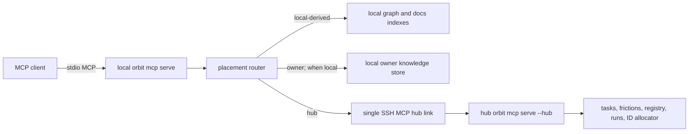

# Orbit MCP Bridge — Design

This document specifies the **target** design; nothing here has landed. It replaces
both Bridge's HTTP parity layer and the earlier
per-workspace-authority draft with a local broker that has one remote destination:
the coordination hub. It covers client→hub transport and local tool placement. The
reverse direction — placing a run, leasing it from a spoke, and reporting its result
— belongs to [host-registry/2_design.md §4](../host-registry/2_design.md) and is not
reimplemented here.

## 1. Coupled Contract with Host Registry

The two features have a strict ownership split:

| Question | Owner |
|----------|-------|
| What is this machine's stable identity? | Host registry (`host.toml`) |
| Which machine is the coordination hub? | Host registry (machine-level role/config) |
| Which machine owns this workspace? | Host registry (hub binding + local owner/replica role) |
| Which machines have a usable checkout? | Host registry (workspace presence map) |
| Which machine should execute a run? | Host registry (owner default, task preference, lease) |
| Which placement executes an MCP tool? | MCP bridge (canonical placement metadata) |
| How does a spoke reach the hub? | MCP bridge (`mcp.toml` trust + SSH-carried MCP) |
| Which tools may this client or runner invoke? | MCP bridge (capability set) |
| How are hub and local results composed? | MCP bridge (tool-specific composite implementation) |

The topology is an invariant, not a routing algorithm:

1. Every non-hub machine may initiate one kind of cross-machine connection: to the
   hub.
2. The hub never initiates a connection to a spoke.
3. The hub never forwards or proxies a call to a workspace owner.
4. A spoke never opens a route to another spoke, even when that spoke owns the
   workspace.
5. `machine_id`, never renameable `host_id`, is the durable identity in bindings,
   session context, leases, and audit.

Bootstrap order:

1. `orbit init` creates local host identity and records whether this machine is the
   hub or a spoke. For a spoke, the operator also obtains the hub's stable
   `machine_id` from hub initialization output or `host.toml` over a trusted
   out-of-band channel.
2. The operator or an Orbit bootstrap helper writes `~/.orbit/mcp.toml` with the
   hub's SSH alias and expected `machine_id` before any registry mutation is
   attempted.
3. The spoke opens the SSH-carried MCP link and registers with the hub. The remote
   process reports its hub `machine_id` during preflight; a mismatch fails before
   registration.
4. `orbit workspace init/link` records the workspace owner on the hub and mirrors
   local role as `owner` or `replica`.
5. `orbit mcp serve` can now route hub-class tools. Missing or inconsistent state
   fails closed and never falls back to a spoke-local coordination store.

V1 does not silently trust the first Orbit process reached through an arbitrary SSH
alias. OpenSSH host-key verification authenticates the SSH endpoint; the separately
copied `machine_id` pins the intended Orbit hub. A future interactive TOFU flow may
display and confirm the first-seen ID, but it is not the unattended default.

Workspace role and transport trust remain separate. A workspace entry stores
`owner`/`replica` identity; it does not store an SSH target. `mcp.toml` grants a
route to the hub only and cannot redefine ownership.

## 2. Process Topology

### 2.1 One client-facing local broker

Every MCP client registers the same command:

```text
orbit mcp serve [--capabilities agent|operator]
```

CLI-generated client config and plugin manifests keep that command fixed. The
manifest does not encode `dk1`, workspace ownership, or operator privilege. The
process reads trusted machine-local state after startup.

The broker starts without requiring a workspace cwd and advertises Orbit's
canonical schemas. Workspace resolution happens from explicit tool input or MCP
session context (§3), continuing [ADR-0199]'s direction.



There is deliberately no edge from `HubMcp` to a workspace owner. For a
spoke-owned workspace, current knowledge remains on that owner and reaches other
machines only through Git replication in v1.

### 2.2 Hub mode

The remote process is explicit and non-recursive:

```text
orbit mcp serve --hub [--capabilities agent|operator|runner]
```

Hub mode:

- accepts registered workspace IDs, not caller filesystem paths;
- executes hub-placement tools against the coordination plane;
- allocates global learning/ADR IDs for every workspace;
- may execute owner knowledge tools only when the hub itself owns that
  workspace and has the canonical checkout;
- returns `owner-current-state unavailable from hub` for a spoke-owned workspace;
- never opens another MCP/SSH connection; and
- reserves stdout for MCP frames.

The `--hub` spelling is the public conceptual shape; implementation may use an
internal subcommand if that better preserves CLI compatibility. Orbit constructs
the fixed remote command; `mcp.toml` cannot inject arbitrary shell text.

### 2.3 Hub-local short circuit

When the current machine's role is hub, hub-class calls dispatch directly through
the local `OrbitRuntime`/global coordination runtime. The broker does not SSH to
itself or add a second MCP serialization boundary. Placement and capability
preflight remain identical to the remote path.

## 3. Workspace, Role, and Session Resolution

### 3.1 Route resolution preserves identity and checkout

For every workspace-scoped tool, the broker resolves:

```text
WorkspaceRoute {
  workspace_id,
  local_checkout_root?,
  local_role: owner | replica | absent,
  owner_machine_id,
  hub_machine_id,
  local_is_hub,
}
```

Workspace address precedence remains:

1. non-empty explicit `workspace` input (registered workspace ID or local path);
2. MCP initialize metadata `initialize.params._meta.orbit.workspace`;
3. otherwise, a clear `missing workspace` error.

Process cwd is not a fallback. A path selector is accepted only at the local edge:
the broker validates the checkout's `.orbit/config.yaml` binding, preserves that
exact root for local-derived and locally owned tools, and resolves its stable
`workspace_id` for hub tools. The path may be an Orbit-managed worktree and need
not equal the host registry's base presence-map root.

An ID-only selector resolves the machine's registered default checkout when local
execution is required. Hub-only tools need no local checkout after the ID is known.
Owner tools execute locally when `local_role=owner`, through the hub link when the
hub is the declared owner, and otherwise report that no live route exists.
Local-derived tools require a validated checkout. Missing/ambiguous local state
fails with an instruction to announce a path rather than silently using the base
checkout or another machine. Composite tools declare their local prerequisites as
well: `orbit.search kind=doc|all` requires a local checkout even though some of its
branches could execute on the hub (§7).

Only `workspace_id` crosses the hub link. Local absolute paths, replica paths, and
worktree roots never do.

### 3.2 Session metadata extension

`ToolSessionContext` expands from one workspace string to transport-owned context:

```json
{
  "workspace": "/local/path/or/ws_id",
  "workspace_id": "ws_orbit",
  "caller_host": {
    "machine_id": "hm_9f2c81d4",
    "host_id": "dk-mac"
  },
  "origin_session_id": "mcp-...",
  "mcp_call_id": "mcall-...",
  "leased_run": {
    "run_id": "jrun-...",
    "lease_id": "lease-..."
  }
}
```

Only `workspace` comes from the external client's initialize metadata. The broker
derives stable workspace/caller identity from local registries and generates the
session/call IDs. `leased_run` is optional and is injected by the runner when it
launches an executor's broker; it is not accepted from model-authored tool input.
The nested hub session receives the derived context.

In the v1 same-user SSH model, caller `machine_id` is provenance rather than a
separate authorization credential: SSH authenticates the OS user and the hub
registry validates that the ID exists. A trusted spoke could spoof another
registered ID by bypassing the Orbit connector. This is an explicit single-operator
trust assumption (§12), not a multi-tenant security boundary.

## 4. Canonical Tool Placement

### 4.1 Placement is tool-registry metadata

Every MCP-exposed tool definition gains one required placement value:

```rust
enum ToolPlacement {
    Hub,
    Owner,
    LocalDerived,
    Composite,
}
```

The value lives beside the canonical schema and safe-surface metadata. It is not a
second connector allowlist and is never inferred from a name prefix. A tool without
placement metadata is not exposed by the multi-host broker.

Initial classification:

| Tool/domain | Placement | Reason |
|-------------|-----------|--------|
| `orbit.task.*` | `hub` | Coordination lifecycle, task artifacts, and task IDs are hub-only |
| `orbit.friction.*` | `hub` | Mutable triage lifecycle belongs to the coordination plane |
| `orbit.host.*`, `orbit.workspace.*` | `hub` | Global inventory and ownership bindings live on the hub |
| `orbit.crew.list`, task crew validation | `hub` | Dispatch consumes the owner-published execution profile (§8) |
| `orbit.workflow.*`, run observation | `hub` | Canonical dispatch and run records live on the hub |
| `orbit.run.lease/report/presence` | `hub` | Spoke pollers terminate at the hub queue |
| `orbit.learning.show/update/supersede` | `owner` | Current content/lifecycle belongs to the workspace owner |
| `orbit.adr.show/update/supersede` | `owner` | Current content/lifecycle belongs to the workspace owner |
| `orbit.learning.add`, `orbit.adr.add` | `composite` | Hub allocates the ID; owner finalizes locally (§6) |
| `orbit.auto_task.add/list/show/update/toggle` | `owner` | MCP CRUD manages the Git-versioned definition; it does not mint tasks |
| `orbit.graph.*` | `local-derived` | Index represents the caller's checkout/worktree |
| Docs/semantic index operations if later exposed | `local-derived` | Rebuildable checkout-derived state |
| `orbit.search` | `composite` | Hub task branch + local docs + role-aware knowledge branches (§7) |

Routine scheduler state stays local and CLI-only. The auto-task scheduler pass is
composite in operation but is not an MCP tool-registry entry: it reads definitions
and the host-local cursor from the selected machine's checkout, performs dedupe
against hub task state, and creates due tasks on the hub. It must never mint into a
spoke-local task store. Friction search is not a current `orbit.search` kind; if
added, it is a hub branch.

### 4.2 Owner preflight permits only local or hub ownership

`Owner` does not mean "find and contact any owner." It means:

1. resolve the declared owner and local role;
2. if the owner is local, require a validated owner checkout and execute locally;
3. if the owner is the hub, dispatch through the one hub link;
4. otherwise return a current-state-unavailable error naming the spoke owner; and
5. never ask the hub to relay or proxy the call.

This preflight preserves the star topology. A non-owner who needs a new
learning/ADR files a task on the hub for owner execution, matching host-registry's
v1 rule.

### 4.3 Contract ownership and version skew

Orbit's registered tool definitions remain the only schema source. Bridge does not
vendor a snapshot, duplicate Pydantic arguments, or recreate errors. The local
broker advertises schemas from its installed Orbit binary and includes an MCP
contract revision plus a digest for the hub-routed subset when opening the hub link.

The hub binary may differ in release version only when the contract revision and
hub-schema digest match. A mismatch fails hub routing before dispatch and names both
versions/revisions. Local-derived and eligible owner tools may remain usable;
there is no translation compatibility layer.

## 5. Hub Transport and Trusted Configuration

### 5.1 `mcp.toml` describes one hub

Trusted configuration is machine-local and names exactly one stable hub:

```toml
# ~/.orbit/mcp.toml on a spoke

[hub]
machine_id = "hm_41a92e70"
transport = "ssh"
host = "dk1"                  # OpenSSH Host alias
allowed_capabilities = ["agent", "operator"]
```

Rules:

- `machine_id` must equal the hub identity recorded at machine initialization/
  registration. `mcp.toml` cannot select a different coordination plane.
- `host` is an OpenSSH alias only. V1 accepts no arbitrary SSH command, remote
  shell fragment, extra environment, or per-repository override.
- `allowed_capabilities` is a non-empty, non-hierarchical trust set. A client
  cannot request a capability absent from the set; allowing `operator` does not
  grant `runner`, and allowing `runner` does not grant `agent` or `operator`.
- Repository `.orbit/config.toml` cannot change the hub, SSH target, or capability.
- Hub rename does not break the mapping because `machine_id` is stable.
- On the hub machine, no `[hub]` transport entry is required; dispatch short-
  circuits locally.

There is no target per workspace and no owner target. Adding a workspace or moving
ownership requires no MCP transport change.

### 5.2 SSH-carried stdio MCP

The spoke broker starts a fixed command equivalent to:

```text
ssh dk1 orbit mcp serve --hub --capabilities operator
```

and relays MCP frames over stdin/stdout. Orbit performs the handshake, verifies the
contract revision, and sends stable workspace/caller context. SSH owns
authentication, encryption, host verification, keys, and remote OS authorization.
Orbit opens no listening port and invents no bearer token.

One hub link is cached per effective capability with a bounded idle lifetime. A
later call may reconnect after failure, but an interrupted mutation is never
retried automatically (§9).

## 6. Artifact and Knowledge Semantics

### 6.1 Read/write placement

| Artifact | Current write path | Current read path | Replica/derived path |
|----------|--------------------|-------------------|----------------------|
| Task, review thread, task artifact | Hub MCP (in-process on hub) | Hub MCP | None |
| Friction | Hub MCP (in-process on hub) | Hub MCP | None |
| Learning, ADR — owner machine | Hub ID allocation + owner finalize | Owner checkout | Git is downstream replication |
| Learning, ADR — hub-owned workspace from a spoke | Hub MCP | Hub MCP | Optional local Git replica |
| Learning, ADR — non-owner of a spoke-owned workspace | Unsupported | No live current route | Explicit Git replica after pull/reindex |
| Code graph | Local-derived | Local-derived | Local graph index |
| Docs search | Local-derived | Local-derived | Local docs/semantic index |
| Routine cursor/pause | Local CLI | Local CLI | Local scheduler store |

This is the honest cross-machine read contract. Coordination artifacts are read
through the hub. Current knowledge does **not** flow across owners in v1: the hub
serves it only when the hub owns that workspace, and never proxies to a spoke owner.
Every other machine reads a pulled Git replica explicitly or routes actionable work
as a task to the owner. Graph/docs remain local.

### 6.2 Knowledge creation

`orbit.learning.add` and `orbit.adr.add` are composite owner operations:

1. resolve the workspace owner;
2. if the owner is local, request the next global ID from the hub, then finalize in
   the exact local owner checkout;
3. if the owner is the hub, send one hub call that allocates and finalizes in the
   hub's owner checkout;
4. if another spoke owns the workspace, reject before allocation; and
5. correlate allocation/finalize audit with one `mcp_call_id`.

Both successful paths reuse the existing local file/index atomicity and rollback
boundary on the machine that owns the checkout.

This is not a reservation protocol. The allocator advances once and returns an ID;
there is no pending reservation row, lease, expiry, abandon, or remote finalize.
Allocation and local finalization are seconds apart on the sole writer. If local
finalization fails after allocation, the ID is consumed and the sequence has a gap.
Gaps are valid and safer than inventing distributed commit.

A non-owner add for a spoke-owned workspace fails before allocation and names the
owner. The suggested recovery is a hub task placed on that owner, not an MCP route
to it. A spoke working on a hub-owned workspace is not this case: its call executes
on the hub because the hub is the owner.

That rejection governs the agent-facing CLI/MCP mutation surface. It does not
remove host-registry's explicit human manual-execution escape hatch: a human may
allocate the global ID at the hub, author the narrative file on a branch, and let
the repository gate arbitrate the PR. That path does not make the replica's Orbit
store an author and is not exposed as non-owner `learning.add`/`adr.add`; see
[host-registry/2_design.md §4–5](../host-registry/2_design.md).

### 6.3 Knowledge lifecycle and sidecars

Update/supersede/show execute on the owner. When the hub owns the workspace, a spoke
can reach those same local operations through the hub link because hub and owner are
the same machine. Otherwise the hub returns `current knowledge owned by <host-id>;
no live route in v1`.

The automatic learning sidecar follows the same rule:

- owner: query current local learnings;
- spoke working on a hub-owned workspace: query current learnings through the hub;
- non-owner of a spoke-owned workspace: disabled by default with an explicit
  availability note; a future freshness-checked replica mode may opt in.

It never injects a stale replica silently.

## 7. Role-Aware `orbit.search`

`orbit.search` currently searches task, doc, ADR, and learning branches and merges
them round-robin. The broker preserves in-kind ranking and total-limit fairness but
routes branches by role:

| Search branch | Route |
|---------------|-------|
| Task or task semantic-neighbor | Hub |
| Doc | Exact local checkout |
| ADR/learning, caller is owner | Current owner index |
| ADR/learning, hub owns workspace | Hub current index |
| ADR/learning, caller is replica of spoke-owned workspace | No current route; explicit replica only |

Checkout requirements are also explicit. `kind=task` is hub-only and works from an
ID-only operator session. `kind=adr|learning` can work without a local checkout only
when the hub owns the workspace. `kind=doc` and `kind=all` require a validated local
checkout; without one, the broker fails before dispatch and asks the caller to
provide a path or choose a narrower hub/owner-readable kind. V1 has no implicit doc
omission and never returns a partial `kind=all` result merely because the operator
session has no checkout.

Knowledge search adds an explicit input:

```text
knowledge_read = current | replica | omit
```

- `current` is the default. Explicit `kind=adr|learning` fails when the caller is
  neither owner nor using a hub-owned workspace.
- `replica` is opt-in and requires a local checkout plus a successful
  reindex-from-files. Results are marked `consistency=replica` with owner ID,
  indexed commit, and index timestamp.
- `omit` is accepted only for `kind=all`; it excludes ADR/learning branches and
  records that exclusion in response metadata.

For `kind=all`, the broker either has a current knowledge route, receives explicit
`replica`, receives explicit `omit`, or returns an actionable error. It never
silently drops knowledge branches and presents the remainder as complete. When all
requested branches resolve, the existing round-robin merge and total limit apply.

Response routing metadata names the workspace ID, branch placement, machine IDs,
and knowledge consistency. Absolute paths never cross the hub link.

## 8. Capability Sets, Discovery, and Dispatch

Placement answers *where*; capability answers *whether*:

| Capability | Intended holder | Surface |
|------------|-----------------|---------|
| `agent` (default) | Ordinary coding agent | Safe task/knowledge/search/graph/auto-task tools plus read-only crew discovery |
| `operator` | Cowork orchestrator or trusted operator | `agent` plus workspace/host discovery, `workflow.ship`, and run observation |
| `runner` | Registered spoke poller | Presence/profile refresh, lease, heartbeat, and report for that machine's runs only |

`operator` does not imply `runner`, and `runner` does not imply `agent`. Destructive
administration remains CLI-only. The effective hub surface is the intersection of
the requested set, local `mcp.toml` ceiling, and hub policy.

The poller and the executing agent use separate logical sessions. The daemon leases,
heartbeats, and reports through a `runner`-capability session. After lease, the
executor launches the ordinary local broker with an `agent`-capability session,
bound in audit/session context to the leased `run_id` and `machine_id`; that session
performs task status, review-thread, artifact, and eligible knowledge operations.
The two sessions may reuse the same SSH host identity, but capability filtering and
audit remain independent. A non-owner executor still cannot author knowledge for a
spoke-owned workspace.

Four independent routing choices remain separate:

| Concern | Source | Meaning |
|---------|--------|---------|
| Caller model | MCP write provenance (`model`) | Which agent family made the call |
| MCP capability | Client request ∩ trust ceiling ∩ hub policy | Which tools the session may use |
| Execution crew | Hub execution profile plus task `crew` | Which provider/model runs the task |
| Execution host | Hub host registry plus task `host` | Which registered machine leases the run |

### 8.1 Owner-published execution profile

The hub must validate crew and dispatch without contacting the owner. Therefore the
workspace owner publishes a small **execution profile** to the hub during register/
poll and whenever relevant config changes. At minimum it contains:

- config revision/digest and observed-at timestamp;
- default crew and effective crew entries (name, provider, model, backend,
  description, tags); and
- dispatch facts required by `workflow.ship` that are otherwise checkout-local.

This is one-way spoke→hub coordination metadata, not repo content and not a live
proxy. `orbit.crew.list`, task crew validation, and workflow preflight all read the
same projection. Missing/stale owner profile fails dispatch with the owner named;
the hub never asks the owner synchronously.

### 8.2 Operator tools and placement

Bridge's high-level workflow tools move into Orbit:

| Bridge today | Orbit target |
|--------------|--------------|
| `workspace_list` | `orbit.workspace.list` |
| `workflow_ship` | `orbit.workflow.ship` |
| `workflow_run_status` | `orbit.workflow.run.show` |
| `workflow_run_list` | `orbit.workflow.run.list` |

`orbit.host.list` returns stable machine identity, labels, status, last-seen, and
workspace presence. `orbit.workspace.list` returns owner and profile freshness
without exposing spoke absolute paths.

`orbit.workflow.ship` receives explicit task IDs. It resolves task `host` through
the hub registry; unset defaults to workspace owner. It records immutable requested/
actual placement from [host-registry/2_design.md §4](../host-registry/2_design.md).
The hub then waits as a mailbox. A selected spoke leases its run; MCP bridge never
pushes or relays execution.

V1 is submit + observe. Cancellation and automatic backlog discovery are excluded.
Generic pipeline invoke/wait tools are not compatibility targets for this surface.

## 9. Audit, Identity, and Uncertain Outcomes

Hub-class calls record one canonical action audit on the hub with:

- tool name and workspace ID;
- process host (hub) and caller host (originating broker) machine IDs/names;
- transport (`local` or `ssh-mcp`) and capability;
- caller model provenance, origin session ID, and `mcp_call_id`; and
- success/failure before the result crosses the hub link.

Local-derived and locally owned calls audit locally. Composite knowledge creation
has two correlated events: hub ID allocation and owner finalize. The broker does
not duplicate a successful hub domain audit; it records local transport/preflight
failures separately.

If SSH drops after a hub mutation is dispatched, the outcome is unknown and the
broker returns `mcp_call_id`; it never retries. The caller inspects hub state/audit.
For knowledge creation, a confirmed ID followed by local failure consumes the ID.
If allocation outcome itself is unknown, retry may consume another ID; gaps remain
valid and no partial knowledge record exists.

## 10. The Bridge Boundary

After cutover, Bridge remains a constellation gateway but stops impersonating
Orbit:

| Capability | Owner after migration |
|------------|-----------------------|
| Tasks, frictions, learnings, ADRs, Orbit search/graph | Orbit MCP |
| Host/workspace/crew discovery and workflow submit/observe | Orbit MCP |
| Sextant search and document retrieval | Bridge/Sextant |
| Raw one-shot Worker invocation and non-pipeline run control | Bridge/Worker |
| Repository synchronization | Bridge/Worker |
| Personal-memory/profile tools | Bridge/Almanac |
| Bridge session/failure telemetry for remaining calls | Bridge |

Retired Bridge implementation:

- the `orbit_parity` domain and duplicated DTOs;
- the vendored `tools/list` snapshot and refresh script;
- Orbit parity-specific HTTP translation tests;
- Bridge workflow tools after Orbit operator tools reach parity; and
- Orbit edge configuration when no remaining Bridge capability uses it.

Clients register Orbit and Bridge side by side during migration. A later aggregator
must proxy child MCP contracts generically; it must not restore hand-authored Orbit
schemas.

## 11. Migration and Validation

### Phase 0 — accept the coupled boundary

- Review this folder and host-registry together.
- Mark `knowledgebase/polaris/design/orbit/orbit-mcp-bridge.md` superseded and point
  it to this repo-local design so the two contracts cannot drift.
- Allocate repo-local ADRs only after both coupled designs are accepted.
- Decompose [ORB-00424] into ordered implementation tasks.

### Phase 1 — hub/owner prerequisites

- Land stable host identity, one hub role, owner/replica workspace bindings,
  presence maps, and owner-published execution profiles.
- Extend MCP session/audit context with caller/process host identity.
- Preserve current single-machine local behavior until a machine is explicitly
  initialized into hub/spoke mode.

### Phase 2 — placement-aware local broker

- Add `hub`, `owner`, `local-derived`, and `composite` metadata.
- Preserve exact session checkout/worktree paths for graph/docs.
- Enforce owner and replica-mode preflight without spoke-to-spoke discovery.
- Add capability filtering independent of placement.

### Phase 3 — singular hub link

- Add `[hub]` trusted config and fixed SSH hub mode.
- Add contract revision/digest negotiation and bounded connection reuse.
- Propagate workspace/caller/call identity; prove no automatic mutation retry.

### Phase 4 — knowledge and search split

- Add hub global-ID allocation consumed by owner learning/ADR creation.
- Add explicit replica knowledge reads plus reindex/freshness metadata.
- Implement role-aware search and learning-sidecar availability behavior.

### Phase 5 — operator and runner surfaces

- Add host/workspace/crew discovery and high-level ship/run observation.
- Add execution-profile publication and freshness enforcement.
- Add runner lease/report and immutable requested/actual placement.

### Phase 6 — Bridge cutover

- Register Orbit directly on every client while Bridge remains for non-Orbit tools.
- Run conformance tests on hub and spoke brokers.
- Remove Bridge parity after the compatibility window and client inventory complete.

Required validation:

1. Every spoke opens connections only to the configured hub; the hub never opens or
   forwards a connection to an owner/spoke.
2. No hub-class mutation executes in a spoke-local coordination store when hub
   config, SSH, registry, or contract negotiation fails.
3. Agent-surface owner mutations reject replicas of spoke-owned workspaces before
   allocating an ID or writing a file; hub-owned workspaces route only to the hub
   owner. The separate human ID-plus-PR path does not enable replica-store writes.
4. Knowledge add allocates globally at the hub and finalizes in the owner's exact
   checkout; finalize failure creates only an allowed ID gap.
5. Current knowledge for a spoke-owned workspace is never served or proxied by the
   hub.
6. Graph/docs observe the exact session checkout/worktree, never a base or hub
   checkout.
7. Search requires explicit replica/omit semantics when current knowledge is
   unavailable, rejects `kind=doc|all` without a local checkout, and preserves
   current round-robin ranking when branches resolve.
8. Workspace IDs, never spoke absolute paths, cross the hub link.
9. Hub audits distinguish caller and process machine identity; composite knowledge
   audit events correlate by `mcp_call_id`.
10. `agent`, `operator`, and `runner` advertise/enforce the intended surfaces across
    the capability × placement matrix; runner polling and leased-run agent work use
    separate filtered and audited sessions.
11. Crew/host discovery and task validation read the same fresh hub projections.
12. Auto-task CRUD stays owner-placed while the scheduler pass reads local
    definition/cursor state and dedupes/creates tasks only through the hub.
13. Bridge passes its remaining suite without an Orbit schema snapshot or Orbit
   HTTP dependency.

## 12. Concerns & Honest Limitations

- **The hub is a hard dependency for coordination.** A disconnected spoke can
  query local graph/docs and an owner can read existing knowledge, but no task,
  friction, workflow, lease, or new knowledge ID can progress.
- **Each workspace owner is a second explicit dependency.** Owner downtime blocks
  default execution and current knowledge authoring/reading for that workspace,
  even though hub coordination remains available.
- **Current knowledge does not flow across owners.** Non-owners of spoke-owned
  workspaces have only explicit, possibly stale Git replicas. This is a deliberate
  v1 limitation, not an MCP gap the hub is allowed to hide.
- **One MCP surface contains a router.** Orbit owns hub connection lifecycle,
  owner-role preflight, composite knowledge creation, role-aware search, and split
  audit. The star topology bounds this to one remote destination.
- **Global ID allocation can leave gaps.** A local finalize failure after hub
  allocation consumes an ID. Gaps are the explicit cost of avoiding reservations
  and distributed commit.
- **Execution profiles can be stale.** Crew/dispatch validation depends on owner-
  published projections. Freshness gates are necessary and can block dispatch even
  when the owner is otherwise healthy.
- **Version skew needs an explicit contract revision.** V1 fails hub routing rather
  than translating incompatible schemas.
- **Caller host identity is not independently authenticated in the initial
  same-user SSH posture.** Hostile/multi-user runners need per-host principal/key
  binding before `runner` is a security boundary.
- **Two client registrations remain.** Orbit and Bridge own different domains;
  cosmetic aggregation is not worth recreating duplicate Orbit contracts.

## Task References

- [ORB-00424] — umbrella proposal for canonical local/remote Orbit MCP and Bridge
  parity retirement; implementation should follow the coupled phases above.

> Resolve any task above with `orbit task show <ID>` or `git log --grep=<ID>`.
