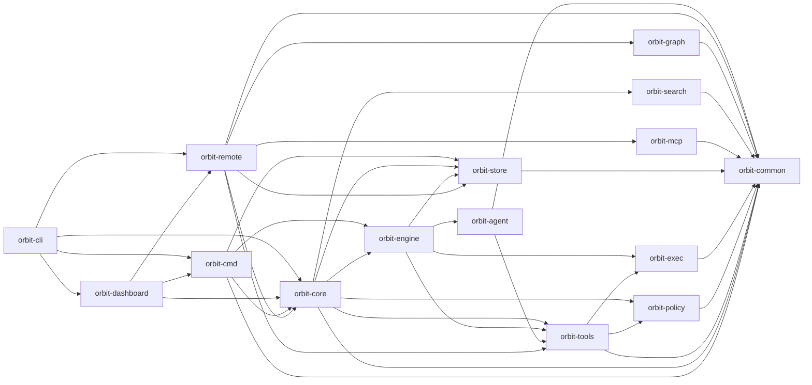

## Crate Graph

Orbit is a layered Rust workspace. Lower layers do not depend on higher layers.

Arrows point from a consumer to its dependency. `orbit-store` and `orbit-mcp` are
neutral kernels that depend only on `orbit-common`. The vertical `orbit-remote`
feature composes registry persistence, MCP policy, broker/hub routing, SSH links,
and spoke registration without introducing a reverse dependency from those kernels.
Layering constrains dependency direction, not feature ownership: a vertical crate
may own its domain model, feature schema, transport policy, and composition end to
end while reusing neutral mechanisms.
`orbit-core` does **not** depend on `orbit-agent`; the bridge is `orbit-engine`'s
`backend: cli` subprocess runner.

## Boundaries

| Crate | Role |
|-------|------|
| `orbit-common` | Shared domain types, errors, IDs, utility helpers. |
| `orbit-policy` | Filesystem-scoping policy and profile resolution. |
| `orbit-exec` | Process, sandbox, and supervision primitives. |
| `orbit-store` | Generic YAML/SQLite stores, connection primitives, namespaced feature-migration ledger, and immutable historical bootstrap migrations. |
| `orbit-graph` | Worktree-local derived graph index and query API; folds language extraction and the (dependent-free, no-command-surface) former CLI layer as modules. |
| `orbit-search` | Retrieval/ranking feature and workspace-local semantic index; also builds `orbit-search-companion`, a separately installed embedding companion binary, as an additional `[[bin]]` target. |
| `orbit-agent` | HTTP loop transport and retained CLI runtimes. |
| `orbit-engine` | Activity/job execution, template rendering, retries, CLI subprocess runner. |
| `orbit-tools` | Generic built-in tool registry and external tool integration. |
| `orbit-mcp` | Generic RMCP framing, server composition, and raw-client kernel. |
| `orbit-remote` | Vertical host/workspace registry, feature persistence, MCP contract and extensions, broker, hub, SSH link, and registration composition. |
| `orbit-core` | Neutral runtime bootstrap, config, runtime-integrated commands, coordination executor, and default asset seeding. |
| `orbit-cmd` | CLI-facing command layer (doctor, migrate, diagnostics, templates, hooks) over `OrbitRuntime`. |
| `orbit-dashboard` | Read-only web dashboard over Core and Remote registry state. |
| `orbit-cli` | Clap-based entrypoint and local client-configuration surface; delegates Remote behavior to `orbit-remote`. |

## Feature Ownership

Feature design docs live under `docs/design/<feature>/` and follow `docs/design/CONVENTIONS.md`.

| Feature | Folder | Lead |
|---------|--------|------|
| Orbit Graph | `orbit-graph/` | `claude` |
| Policy & Sandboxing | `policy-sandbox/` | `claude` |
| Activity / Job | `activity-job/` | `codex` |
| Auditability | `auditability/` | `codex` |
| Groundhog | `groundhog/` | `codex` |
| User Interface | `user-interface/` | `gemini` |
| Host Registry | `host-registry/` | `claude` |
| MCP Bridge | `mcp-bridge/` | `codex` |
| MCP Session Context | `mcp-session-context/` | `codex` |

## Design Mirror

The architecture design docs under `architecture/design/` are generated from the repository's `docs/design/` tree before `dev`, `check`, and `build`.

Do not edit generated mirror pages directly. Edit the source documents in `docs/design/`.
