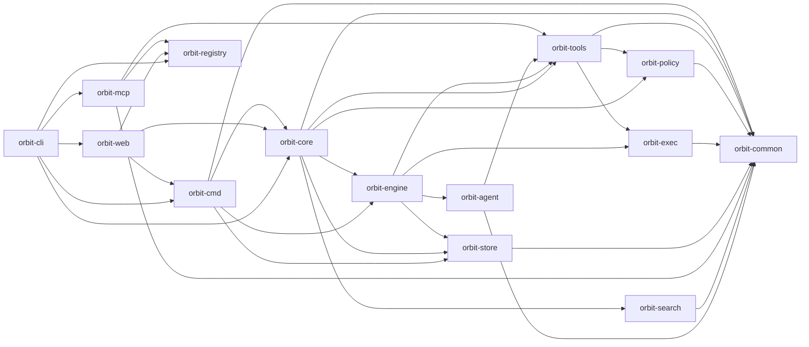

## Crate Graph

Orbit is a layered Rust workspace. Lower layers do not depend on higher layers.

Arrows point from a consumer to a selected dependency. The repository's
dependency-direction guard is the exhaustive edge contract. `orbit-store` is a neutral
persistence kernel. Registry owns local machine/workspace files, MCP owns protocol and
direct SSH transport, and Web owns its HTTP surface and SSH tunnel lifecycle.
Layering constrains dependency direction while each feature keeps one clear owner.
`orbit-core` does **not** depend on `orbit-agent`; the bridge is `orbit-engine`'s
CLI agent subprocess runner.

## Boundaries

| Crate | Role |
|-------|------|
| `orbit-common` | Shared domain types, errors, IDs, utility helpers. |
| `orbit-policy` | Filesystem-scoping policy and profile resolution. |
| `orbit-exec` | Process, sandbox, and supervision primitives. |
| `orbit-store` | Generic YAML/SQLite stores, connection primitives, namespaced feature-migration ledger, and immutable historical bootstrap migrations. |
| `orbit-search` | Retrieval/ranking feature and workspace-local semantic index; also builds `orbit-search-companion`, a separately installed embedding companion binary, as an additional `[[bin]]` target. |
| `orbit-agent` | HTTP loop transport and retained CLI runtimes. |
| `orbit-engine` | Activity/job execution, template rendering, retries, CLI subprocess runner. |
| `orbit-tools` | Generic built-in tool registry and external tool integration. |
| `orbit-registry` | Local machine identity and workspace catalog validation with atomic file persistence. |
| `orbit-mcp` | RMCP framing, canonical discovery, server identity context, and direct SSH stdio proxy. |
| `orbit-core` | Neutral runtime bootstrap, config, runtime-integrated commands, coordination executor, and default asset seeding. |
| `orbit-cmd` | CLI-facing command layer (doctor, migrate, diagnostics, templates, hooks) over `OrbitRuntime`. |
| `orbit-web` | HTTP API, embedded dashboard UI, dashboard mutations, and SSH web connection over Core and Registry. |
| `orbit-cli` | Clap-based entrypoint that composes Core, Registry, MCP, and Web. |

Detailed implementation records remain alongside the source code. They are not
mirrored into this public reference because they contain historical interfaces
and repository-internal artifact references.
