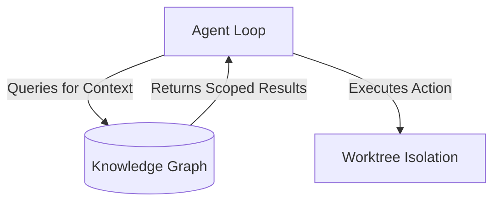

## Definition

The knowledge graph is Orbit's parsed, SQLite-backed model of a repository. It contains directories, files, extracted symbols, import edges, trait implementors, call sites, and source references.

Agents query the graph when they need code context. The graph gives structured selectors and scoped query results instead of large grep output.



## Commands

The graph syncs on demand via a file watcher; force a refresh with `orbit graph sync` (add `--full` for a complete re-index). Query it with:

```bash
orbit graph sync
orbit graph search task
orbit graph show file:crates/orbit-cli/src/main.rs
```

## Branch Scope

Graph data is branch-scoped. Two worktrees on two branches can rebuild concurrently without corrupting each other. Reads can fall back to the default branch until a new branch has graph data.

## Selectors

Common selectors include:

```text
dir:crates/orbit-cli
file:crates/orbit-cli/src/main.rs
symbol:crates/orbit-cli/src/main.rs#main:function
```
