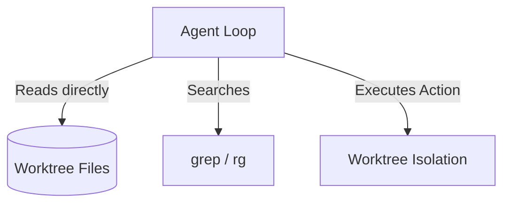

## Definition

The knowledge graph is Orbit's parsed, SQLite-backed model of a repository. It contains directories, files, extracted symbols, import edges, trait implementors, call sites, and source references.

**Status:** as of ORB-10357, the graph engine (`orbit-graph`) has no CLI, MCP, or tool-registry surface — it is not reachable by agents or humans through any command. Agents query code context with `grep`/`rg` and direct file reads instead. The engine ships as a single dependent-free crate pending deletion; this page documents its data model for historical reference.


```mermaid
graph TD
    Agent[Agent Loop] -->|Reads directly| Files[(Worktree Files)]
    Agent -->|Searches| Grep[grep / rg]
    Agent -->|Executes Action| Worktree[Worktree Isolation]
```

## Branch Scope

Graph data is branch-scoped. Two worktrees on two branches can rebuild concurrently without corrupting each other. Reads can fall back to the default branch until a new branch has graph data.

## Selectors

Common selectors include:

```text
dir:crates/orbit-cli
file:crates/orbit-cli/src/main.rs
symbol:crates/orbit-cli/src/main.rs#main:function
```
