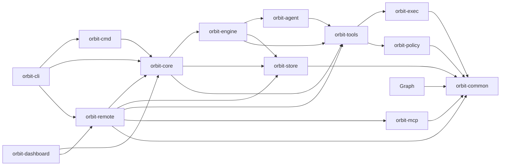

## Crates

| Crate | Responsibility |
|-------|----------------|
| `orbit-cli` | Clap-based entrypoint and local client-configuration surface; delegates Remote behavior to `orbit-remote`. |
| `orbit-cmd` | CLI-facing command layer extracted from `orbit-core`: doctor, migrate, diagnostics, hooks, agent-rules, direct v2 activity runs. Exposes `*Commands` extension traits over `OrbitRuntime`. |
| `orbit-core` | Neutral runtime bootstrap, config layering, default asset seeding, and runtime-integrated command modules. Surfaces `OrbitRuntime` to `orbit-cmd`, `orbit-cli`, `orbit-dashboard`, and `orbit-remote`. Does **not** depend on `orbit-agent`, `orbit-cmd`, or `orbit-remote`. |
| `orbit-remote` | Vertical host/workspace registry, registry persistence, MCP contract/extensions, broker, hub, bounded SSH link, and spoke-registration composition. |
| `orbit-dashboard` | Web dashboard and HTTP API over Core runtime projections and Remote registry state. |
| `orbit-engine` | Activity and job execution, template rendering, retry logic. Owns the `backend: cli` subprocess runner, which references `orbit-agent::{Agent, AgentConfig}` directly. |
| `orbit-agent` | Per-provider `AgentRuntime` implementations under `providers/<name>/<name>_runtime.rs` (claude, codex, gemini, gemini_http, grok, openai_compat, anthropic, ollama, mock_agent). Hosts HTTP `LoopTransport` primitives. |
| `orbit-tools` | Generic tool registry plus workspace-scoped builtins, filesystem tools, and policy-aware exec tools. |
| `orbit-graph` | Worktree-local derived graph index and query API; folds language extraction and the (dependent-free, no-command-surface) former CLI layer as modules. |
| `orbit-policy` | Filesystem-scoping policy engine. Owns `FsProfile` resolution and `denyRead` / `denyModify` evaluation. |
| `orbit-exec` | Process / sandbox / supervision primitives for shell-command execution under an `FsProfile`. |
| `orbit-store` | Generic YAML/SQLite stores, connection primitives, namespaced feature-migration ledger, and immutable historical bootstrap migrations. Feature crates own their active schemas and queries. |
| `orbit-mcp` | Generic RMCP framing, server composition, and raw-client kernel. Remote contract and routing policy live in `orbit-remote`. |
| `orbit-search` | Retrieval/ranking feature and workspace-local semantic index; also builds `orbit-search-companion`, a separately installed embedding companion binary, as an additional `[[bin]]` target. |
| `orbit-common` | Leaf — shared domain types (`OrbitError`, IDs, activity/job schemas) and generic utilities (fs, redaction, logging, blob storage). |

## Dependency Direction

Arrows point from consumer to dependency. Do not add cross-crate dependencies that
violate this direction. Layering constrains dependency direction, not feature
ownership: vertical feature crates may own their domain model, persistence schema,
transport policy, and composition end to end while reusing neutral kernels. Lower
layers stay reusable and never depend back on the feature. In particular,
`orbit-core` must not depend on `orbit-agent` (the `backend: cli` subprocess runner
in `orbit-engine` is the bridge) and must never depend on `orbit-cmd` or
`orbit-remote`.
